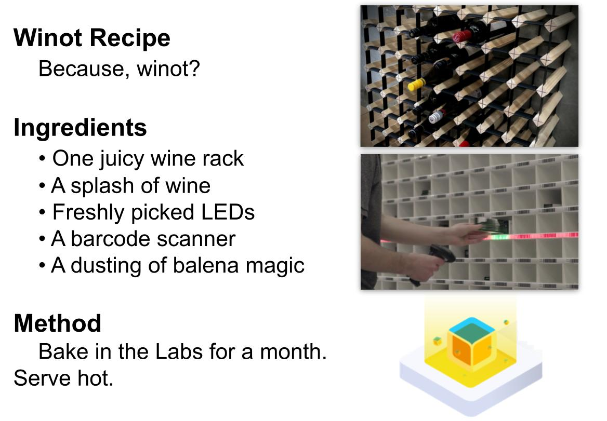
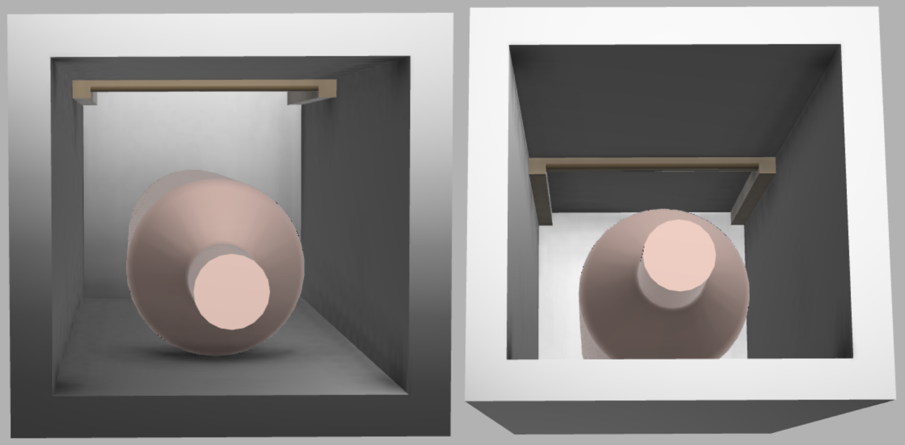
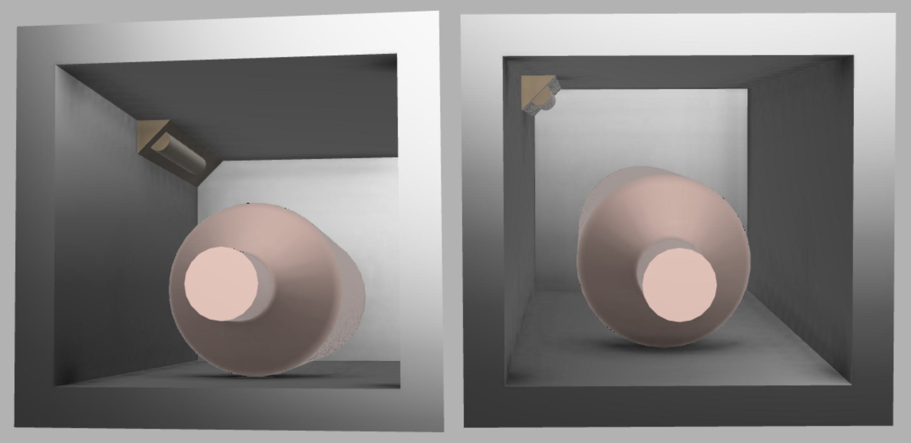
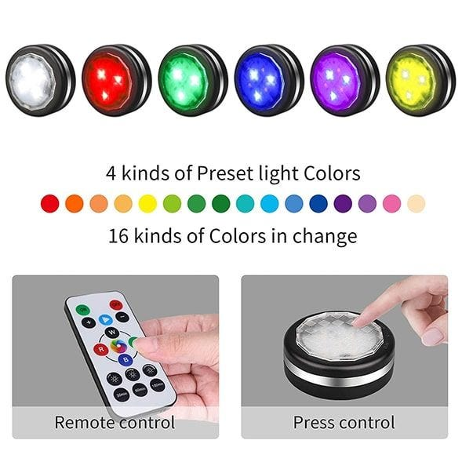
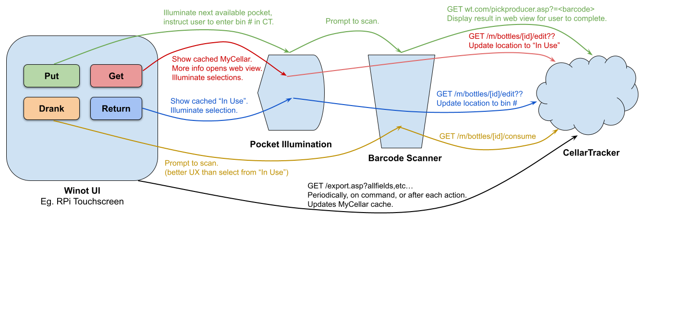
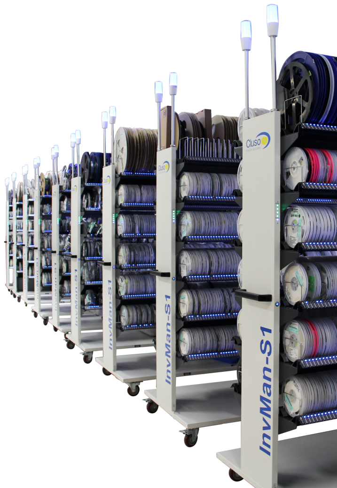
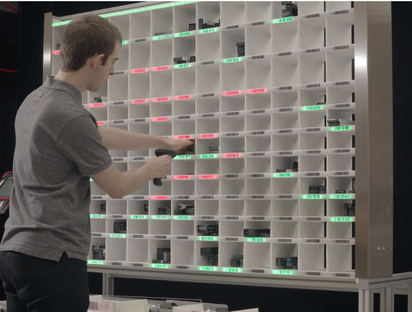
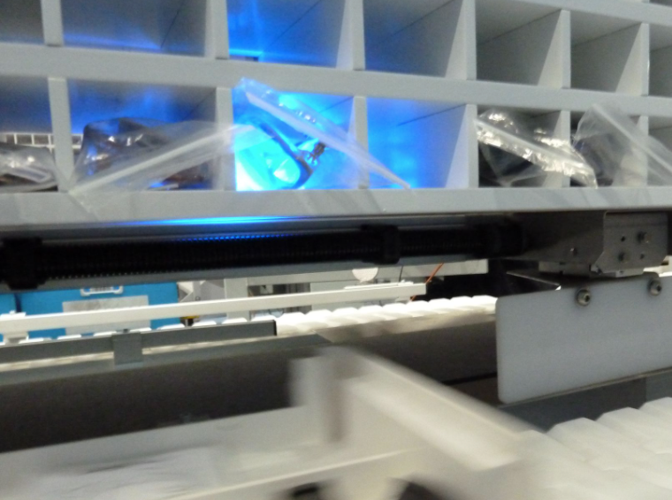
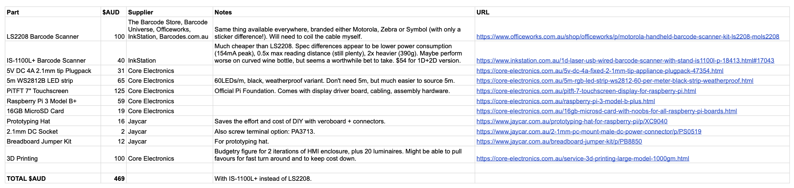
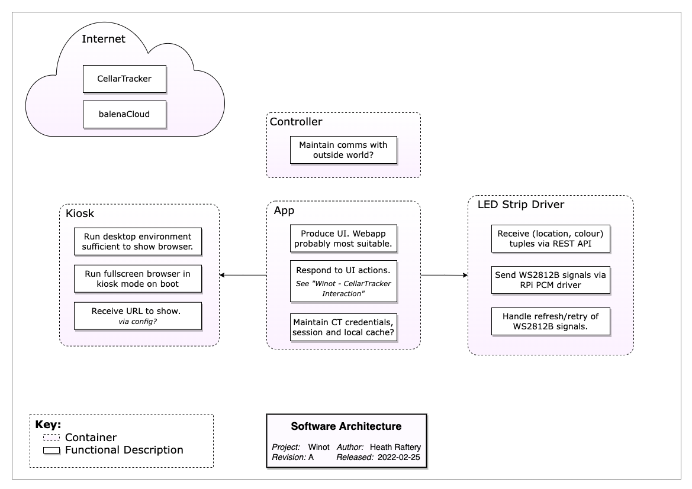

# Winot - Putting the IoT in Wine
## Balena Residency Project

This repository contains the musings, misadventures and measurables from a residency project at balena by Heath Raftery.

Here's to the discovery process.


## Table of Contents
-   [Project Selection](#project-selection)
    -   [Project Attributes](#project-attributes)
    -   [Project Candidates](#project-candidates)
    -   [The Leading Candidate](#the-leading-candidate)
-   [Project Exploration](#project-exploration)
    -   [Avenues for consideration](#avenues-for-consideration)
    -   [Benefits](#benefits)
    -   [Enabling technology](#enabling-technology)
    -   [Major Risks](#major-risks)
        -   [Risk 1: Dataset Availability](#risk-1-dataset-availability)
            -   [Outcome](#outcome)
            -   [Residual Risks](#residual-risks)
            -   [References](#references)
        -   [Risk 2: Pocket Illumination](#risk-2-pocket-illumination)
            -   [Outcome](#outcome-1)
            -   [Calculations](#calculations)
            -   [Form Factor](#form-factor)
            -   [References](#references-1)
    -   [CellarTracker Interaction](#cellartracker-interaction)
    -   [Inspiration](#inspiration)
-   [Project Design](#project-design)
    -   [System Block Diagram](#system-block-diagram)
    -   [BOM](#bom)
    -   [Software Architecture](#software-architecture)
-   [Project Build](#project-build)

---

# Project Selection

## Project Attributes

Four weeks to commit to a project of one's own choosing - a dream come true for a insatiably curious engineer! But how to pin down just one project? These were the self-imposed attributes that guided me:

1. Don't solve anything important.
	- The residency program is a learning exercise. Any resulting utility is a bonus. I've learnt many times that when putting together short projects, the best learning comes from questions, not answers. Projects that set out to solve a problem in the world inevitably find that few interesting problems are skin-deep, and it becomes very hard to divorce the value of the project from its ultimate efficacy. Impactful problem solving requires a deep understanding of the problem and who it affects, and relatively little about the technology and tools that go into it.
	- On the other hand, putting delight first tends to invite divergent thinking, stimulating wonder, play and conversation, all of which are brilliant building blocks for learning.
	- In the ideation phase I often say we should avoid the temptation to jump to solutions, lest we stifle good ideas that need some time. Removing the pressure to solve something is a handy trick to ensure ideas have the opportunity to arise and percolate. And so, the first attribute of this project is remember that although Panadol fixes things, wine gets more people talking.
1. Be tangible.
	- There is lots of meaningful infrastructure work to be done. An enabler always has more impact than an end product. But enablers require a lot more mental work from the audience to join the dots and see value.
	- Enablers are also never finished, and things only get worse if they actually turn out to be useful.
	- On the other hand, a physical proof of concept, warts included, has an obvious early milestone (the demo!) which serves as a useful stopping point for further discussion.
1. Be my own user.
	- Good product design requires great user research. But those activities don't bring much to the residency project.
	- Instead, simplify the undertaking by building something that I can use. Interest beyond that should be an emergent property, not a designed one.
1. Be fresh.
	- Naturally I have no shortage of half-baked projects waiting for a new lease on life. But they all carry context that will require some adaptation. The result is a project that awkwardly governed by competing pressures.
	- Instead, maximise the value of the project by starting fresh, favouring without conflict the purposes of the profect.

## Project Candidates

- IoT button for family chores. Eg. tap when done to unlock the TV or iPad.
	- Love anything related to family stress-relief or time-saving. And IoT buttons capture for me the magic of the tangible - a supremely simple device, but powerful habit forming results.
	- Fails #1: too important and deep a problem to try to solve. 
	- Fails #3: my children are too young to have chores, and coming up with something useful to the family is a overwhelming prospect!
- Availability/mood status for co-working / home office setups. Eg. a little digital sign that shows others whether you're in Do-Not-Disturb mode or not.
	- Love this realm of social norms in the new world.
	- Fails #1: so important that there's dozens of so-so "solutions".
	- Fails #3: highly context-sensitive so I'm unlikely to adopt any particular solution.
- Indoor/outdoor air quality sensor to show "ventilation" metric as a relative measure, rather than just a scary number. Are we getting enough "fresh air" to fend off CO2 poisoning or COVID-19 badness.
	- Fails #1 and #3.
- Home ID. Create a system that means households, instead of individuals, can hold accounts such as electricity or, most importantly, home automation services.
	- Fails #1, #2 and #4.
- Robotic lifters for stranded vehicles to rapidly clear accident sites and restore traffic.
	- Fails #1, #3 and #4.
- Smart farm kit for schools.
	- Fails #3 and #4.

## The Leading Candidate

And the winner?

- A inventory management system for the home wine amateur.
	- As you put wine into your rack, scan it first, the data will be added and the appropriate slot will be illuminated. Then when you go to grab a wine for dinner, ask Siri for a recommendation and she'll highlight choices that pair with your meal. You pick one, scan it out, and you'll hear tasting notes / origin story.

---



---

# Project Exploration
## Avenues for consideration

- Share your library of wines with house guests and let them pick a wine rather than bringing one you don't like!
- Be more conscious with your wine appreciation by selecting wines rather than simply going through them top to bottom.
- Mark your favourite wines at the moment of enjoyment, rather than trying to recall them when you're buying your next dozen.
- We remember experiences better than names, so recall your favourite wines by reviewing your wine history instead of trying to remember what was on the label.
- Never let a maturing wine go to waste! Reminders and stock tracking to ensure the good stuff gets drunk.
- Team up with the Hone Liquid lads to put spectroscopy based analysis in the hands of the home connoisseur!
- Plugins to services like [CellarTracker](https://www.cellartracker.com) to share experiences.
- Spare barcodes for cleanskin bottles.

## Benefits

- Drink more consciously by selecting wines rather than working through them sequentially.
- Develop tastes and preferences by closing the loop on the drinking experience with tasting notes.
- Track your drinking habits to make more informed choices.
- Build a collection with purpose - a wine for every occassion.
- Delight friends and spark conversations at dinner parties.

## Enabling technology

- Barcodes (1D, 2D and RFID) are an underappreciated technology. Classic example of boring, old and unnecessarily pigeon-holed. Potential to get it out of the supermarkets and into the hands of innovators.
	- Eg 1: we had 500 people over the course of a week control enormous colourful tree lights using origami flowers that had RFID tags inside them. Magical action at a distance. https://www.instagram.com/p/B5JKPK9Aufn/
	- Eg 2: barcodes are often used to great effect in semi-automated assembly lines, not just for identification but for command entry, since they can reliably encode arbitrary data. A barcode scanner is very simple to operate in those sorts of environments, and process improvements need only a new barcode sticker printed. https://www.youtube.com/watch?v=SBIH4aiTjug
	- Oh yeah, and for better or worse, COVID-19 taught everyone what a QR code is.


## Major Risks

1. Just how much information can be gleaned by the standard issue barcode? Is the database of identifiers available?
	- See [Dataset Availability](#risk-1-dataset-availability).
1. Individual wine slot illumination might result in a rats nest of cabling.
	- See [Pocket Illumination](#risk-2-pocket-illumination).
1. Is there a strong enough use case for enabling fleet/multiple site management?

### Risk 1: Dataset Availability

Hmm, we have a [problem](https://barcodesaustralia.com/barcodes-for-wine/):

> "There is no compulsory (or comprehensive) barcode database for alcohol products or any other retail product in Australia or worldwide." 

Turns out the best databases are crowd-sourced. Data is spotty. Accessing it will require jumping some unclear API hurdles.

**Assessment: high risk.**

Research was illuminating but not conclusive. On to experimentation. Results are that CellarTracker can be successfully searched by UPC (for free). Vivino can't. So CellarTracker is only option. [Alas](https://www.cellartracker.com/forum/fb.asp?m=339810):

> I have had a few API consumers who have tried to use the API as a backdoor to try and steal large swathes of my wine database (no user data) or generally create inadvertent denial of service issues. They have ruined the party for everyone else. So I am not interested in providing any further access to my API except in the context of a much larger business discussion. I have a few such partners (e.g. Cor.kz, CellarVU, WineGlass), but generally those are very time consuming relationships to setup. So while I am open to receiving email about potential partnerships, at this point I am (a) not interested in having coffee or conference calls with everyone who is interested (about 10 such approaches per week), (b) not interested in opening up a general purpose API, (c) and not interested in selling or licensing my database.

#### Outcome

I think I see a profitable way forward. If can't beat them, join them. See [CellarTracker Interaction](#cellartracker-interaction).

#### Residual Risks

- User session management. Cookies? Authentication?
- Discoverability, stability and utility of undocumentated URL scheme.

#### References

- [International Barcodes Database](https://barcodesdatabase.org) - searchable database. Turns out a small fraction of barcodes are in the database!
- [GS1](https://www.gs1au.org) - GS1 is the umbrella standard for UPC/EAN/etc. GS1 Australia is a major barcode issuer in Australia.
	- [Barcodes Australia](https://barcodesaustralia.com/barcodes-for-wine/) - a smaller issuer? Has a useful FAQ about barcodes on alcohol.
	- [Hally Labels](https://www.hallylabels.com/labels-blog/wine-labelling-resources-you-need-to-know-the-complete-list/) - ditto
- [CellarTracker](https://support.cellartracker.com/article/10-about-upc-and-ean-barcodes) - an wine rating app that happens to have assembled "one of the largest wine databases" with 1.2 million barcodes, but warns that barcodes aren't a 100% reliable way of identifying a wine.
	- Gets [lots of requests](https://www.cellartracker.com/forum/tm.asp?m=24391) to access that database via API and is working on it.
	- These days recommends and heavily supports printing your own barcodes that are specifically linked to entries in the CT database. How redundant that is is not clear.
- [Vinloco](https://www.vinloco.com) - another wine rating app, so may have a database.
- [Naked Wines - Q&A on scanning barcodes](https://www.nakedwines.com/wall/single_view.htm?threadId=108341763&cid=UK) - 6 year old but very relevant discussion on apps that recognise wine barcodes.
	- [Vivino](https://www.vivino.com/AU/en) - most popular suggestion.
	- [Delectable](https://delectable.com) - next most popular.
		- Label only, not barcode.
- [Corkz](https://apps.apple.com/app/apple-store/id294379127) - seems to add barcode scanning to CellarTracker and ViVino too.
	- Ah okay, relationship seems to be: CT and Vivino have separate databases, but CT uses Vivino to provide *label* (image) identification. CT has its own barcode identification and mobile app functionality, so doesn't need Corkz any more. But Corkz can still be used to provide mobile access to your CT account.
- [Untappd](https://untappd.com)
	- Same story, but beer: "created its own barcode database based on brewers submission and/or crowdsourced from users. It seems to work really well in my experience, but did require years of growth".

### Risk 2: Pocket Illumination

How to install and drive individual, coloured, low-UV (to avoid spoiling) illumination of wine rack pockets?

- Cabling is looking dead in the water - would either be tremendously unsightly or require drilling into walls. Either option manageable for permanent installs, but scores poorly on the WAF for a MVP.
- Wireless has serious challenges. Need uniquely addressable and non-line-of-sight, so IR is out. Market is swamped with IR, but nothing suitable with RF. Is it even feasible to leave a battery powered light on in RF receive mode? Lighting duty is very low, but useful figure for 433MHz receive mode is 4mA continuous. That's 250 hours for a 1000mAh AA battery. That's 10 days. With polling could get 10x easily. 100x (listen for 5ms every 500ms) is possible.
	- This sounds like a project in itself. Perhaps a worthwhile one. Maybe phase 2, and make do with cables and hand-waving for now?

#### Outcome

After some experimentation, I have decided:

- standalone lights are a really interesting path to pursue, with potential of its own. But for now, running down dozens of batteries and debugging wireless gremlins is too much scope to deal with. I cannot find a way to justify the cost, maintenance and installation requirements of batteries in the order of 3 AAA's per pocket.
- wired lights, with some very discreet holes in the wall, eliminates too many unknowns to pass up for version 1.
- addressable LED strip is:
	- widely available;
	- reduces cabling to 3 wires in total;
	- has predictable and pleasing aesthetics;
	- comes with suitable adhesive mounting method;
	- can be cut and re-connected for passing through holes and around corners

#### Calculations

My wine rack provides a useful set of design parameters.

- 16 pockets
- Each pocket measures 118x112x295 (WxHxD) internal.
- WS2815 is 12V, WS2812B is 5V.
	- 5V will require power injection every 3-5m.
	- WS2815 has 4 fourth wire for failed LED backup.
	- WS2811 is also 12V, but LEDs are controlled in groups of 3, not individually... which might be all we want.
- Strips are typically 30, 60, 100 or 144LEDs/m, which is 3, 6, 10 or 14 RGB LEDs per 100mm.
	- 60LEDs/m strips have 17mm cuttable sections (102mm for 6).
- LEDs are 60mA max (20mA each for R, G and B).
	- So for 16 pockets with 100mm of LEDs, works out to be 1A max for each LED in a pocket. So for 3 LED pocket, 3A. For 10 LED pockets, 10A.
		- For one pocket at a time operation: 120mA, 240mA, 600mA, 840mA.
- 5V WS2812B strips are far easier to source, and we only have about 1.6m of actual LEDs, so maybe 12V not important. Will all the cutting and wiring affect that?
	- But still, hard to supply max current.
	- Relatively easy to source a 5V, 4A wall wart. Beyond 4A it'd be a separate supply.
	- A Pi3 + 7" touchscreen will be 750mA continuous.
	- So we could possibly run a 30LEDs/m strip flat out, or a 60LEDs/m if only half the LEDs are on at once.

#### Form Factor

Essential criteria are:

- subtle impact on rack aesthetics
- great lighting effect - this is the money shot opportunity
- don't interfere with rack function

Desirable criteria are:

- leave no trace when removed
- inexpensive, since this is the part that needs to scale
- can be adapted to other wine rack styles

The rack pockets are deep and nearly square. The bottles are round and are typically a tad longer than but not as wide as the pockets. Occassionally though, bottles do come close to filling the pocket height.

Options:

1. Dome light in ceiling of pocket.
	- Standalone lights are often this form factor, and is a common way to light trophies or other recessed displays.
	- But in our case the "trophy" is laid flat, plus we don't have much room to spare here and it will likely get bumped or obscured.
1. Something on the back wall - in a corner or along an edge.
	- Difficult to avoid shining in to user's eyes from some angle.
1. LED strip across ceiling of pocket, part way down.
	- Allows "in" wiring and "out" wiring to run down either side of the pocket.
	- With experimentation, could find optimal placement down depth of pocket.
	- Ensures some light on bottle and some for the pocket.
	- Highly symmetrical aesthetics.
	- But requires two holes in the back of each pocket, and still might get bumped when inserting/removing wine.
	- Also has unpredicable visual effects based on proximity of bottle, all the way from absent to right next to part of the strip.
	- 
1. LED strip part way along one or both top edges.
	- Guaranteed to be out of way of bottle, since bottle is round in a squarish hole.
	- Requires "in" and "out" wiring to be doubled back on itself.
	- Symmetry requires double the effort. Asymmetry only requires one hole.
	- Basic animation is possible, since we have depth?
	- Could do bottom edges for easier mounting but aesthetics "feel" like they would be poorer.
	- 


#### References

This is the sort of thing that is widely [available](https://www.jhmarket.com.au/leastyle-battery-operated-led-under-counter-lights-in-black-pack-of-6.html?gclid=Cj0KCQiAmKiQBhClARIsAKtSj-m5L7Szz0UcwTkiGnD8J5Tqh03MxcRDMQeKKnfYdnlQTA6yK28qMEcaAsgMEALw_wcB) and cheap. But is IR, so a deadend. And it's a bit bulky.



[This](https://www.ebay.com.au/itm/261835853404) is 433MHz and getting close but requires 12V power.

## CellarTracker Interaction

Risk reduction activities revealed that the biggest risk was in fact, a big hairy potential showstopper. The project premise assumes there's some publicly accessible dataset of barcode to wine relationships. Because surely every retailer doesn't create their own in private, right? Turns out there's [nothing even close](risks), and even if there was, it wouldn't always uniquely identify wines. I guess that's why they called it a Universal Product Code and not a Globally Unique Identifier...

It turns out the world's best database for wine identification is a proprietary, largely crowd-sourced, for-profit effort that drives a website called CellarTracker. And the owner [got burnt](https://www.cellartracker.com/forum/fb.asp?m=339810) trying to provide a public API and has closed the door.

A Raspberry Pi based web browser that allows the user to use CellarTracker hardly sounds like a ground-breaking IoT project, so Winot is looking shakey. I'm allergic to "there's an app for that" reductionism and always think physicality first, so just another web app would be a failure in my eyes. Except...

- A proprietary, crowd-sourced dataset is a healthy indicator of a vibrant community of users who see value in that data. 
- The data is high quality, continually checked and updated, with metadata like reviews and prices.
- CellarTracker already does the finicky and non-novel account/inventory management stuff.
- And, if I take as a design constraint that the wine database is proprietary, all I *really* need to do the headline Winot features of:
	- local control of pocket lights, and
	- semi-automated entry of wine data;
- is a read and submission entry point to the user's cellar data respectively. [Ooops](https://www.cellartracker.com/forum/printable.asp?m=443838), looks like we can fumble our way there. Experimentation results are favourable - might have to do some non-ideal things like polling and hand-off to the website, but with a bit of UX grease, these constraints can become nearly invisible. The key is to swim with CellarTracker, not perpendicular to it, and do better together.

It would look a little something like this:




## Inspiration

- The [InvMan S-1](https://www.cluso.com.au/invman) from Cluso Vision Systems by our friends at CircuitWise.

- The [Pick To Light](https://www.monk-conveyors.com/pick-to-light/) system from Monk Conveyors


- Turns out inventory solutions are sought after! And naturally, the Internet sees "apps" as the solution. Yep, another boring database to maintain by "entering all of your bottles into a large spreadsheet", or "organising you wine by producer, varietal or vintage". I'm falling asleep at the thought of it.
	- [Found a wine management software yet](https://www.winecellarinnovations.com/blog/2010/10/06/found-a-wine-management-software-yet/)
	- [How to take wine inventory](https://home.binwise.com/blog/how-to-take-wine-inventory)
	- [How to Use a Wine Cellar Tracking App to Inventory and Barcode Your Wine Collection](https://blog.vinfolio.com/2017/06/28/use-wine-cellar-tracking-app-inventory-barcode-wine-collection/)


# Project Design

Having explored the major risks and constraints, it's now time to come up with a design.

## System Block Diagram


## BOM



[Source](https://docs.google.com/spreadsheets/d/1Vril53xEtRFOpUpF5h6KM9TFz6D7Ar1aQKYEL28-_Lo/edit?usp=sharing)

## Software Architecture



# Project Build

With enough design down on paper to see how all the pieces will fit together, it's time to chase out the design flaws by putting some pieces together!

With the BOM ordered and parts trickling in, I turned to software development. To make sure I was taking advantage of the balena platform, I ran through the [getting-started](https://www.balena.io/docs/learn/getting-started/raspberrypi3/nodejs/) tutorial and then realised you can choose your own adventure by language and platform like [this](https://www.balena.io/docs/learn/getting-started/raspberry-pi2/haskell/)! I followed that with the guides on [local mode](https://www.balena.io/docs/learn/develop/local-mode) and [multiple containers](https://www.balena.io/docs/learn/develop/multicontainer).

With that I had a great grasp of how balenaCloud was going to power my application, but I was still reaching for some sort of guidance on a dev environment that would give me the GPIO twiddling power I craved without putting barriers in place when I want to add a HTTP API interface layer to leverage the *services* model that balena empowers. I've spent decades in C based IDEs writing firmware for microcontrollers, cut Python on SBCs to do physical computing, dabbled in Node.js et al for simple user front ends, and consumed a new programming language every couple of years. But now I realise that in coming from a embedded background, this is still new territory - how to transition to what is well encapsulated by the nebulous term, *edge computing*. How do I apply my hardware-centric perspective to a world of containerised apps that drive hardware from a webapp-centric perspective?

Eventually I stumbled on [this](https://www.balena.io/blog/interfacing-balena-edge-devices-with-adafruitio/) and the pieces started to fall together. For better or worse, the marvellous glue language, Python, is the defacto tool for bridging the physical device with the ephemeral cloud. Seeing that a fellow balenista had a (not necessarily ideal) path to success gave me the gumption to bury my reservations about using a dynamic, jack-of-all trades scripting language for *work*, and just get on with it. Extolling the virtues of a Better Way can wait until I get some damn LEDs flashing! Perhaps at that point it may not seem so important.

Now to get started... I realise I've started with the wrong repo template. I'm now creating an app, so I need whatever is required for `balena push` to work. But it's not clear to me how `balena push` turns into something that fires up docker on the device. Maybe `balena push` uploads the entire working folder somewhere and then calls `docker build` on that folder. That would mean two things:

1. managing git is entirely separate. That is, `balena push` and `git push` are unrelated and can operate in different cycles.
2. the entire working copy is acted upon, so anything is fair game, including using `.dockerignore` to limit what `docker build` uses.

Oh great, this is almost exactly what [this](https://www.balena.io/docs/learn/deploy/deployment/) says. Oh that page answers allll my questions. Required reading methinks!

Finally, I'm ready to create a starting repo. What would be really awesome is a document pointing out the purpose of every possible file in a balena app repo skeleton. Just enough to know who it's for so the reader can then use existing knowledge or additional docs to piece the whole thing together.

Alright, got a hello world repo going from the ground up! Now we're underway.

Thinking about a suitable API for `led-strip-driver`. What have others done? `esp8266-fastled-webserver` is a popular example. But the API doesn't appear to be documented! Reading [esp8266-fastled-webserver.ino](https://github.com/jasoncoon/esp8266-fastled-webserver/blob/1b8929c86eb7d42233ff48b41c7c7d516ac8213f/esp8266-fastled-webserver/esp8266-fastled-webserver.ino) suggests it's quite complicated and not very generic:

- GET all|product|info|fieldValue|etc
- POST fieldValue|power|cooing|sparking|speed|etc...

Reminds me of the RGB LED Obelisk we did! Defining "patterns" is complex.

Although it's not as powerful, I think I just want a `off` and `setLED` API for now. That is, just the ability to turn individual pixels to a certain colour.

Eh, so little guidance on a suitable API for what is essentially an array of ints (LED RGB values). REST is really designed for CRUD, and adaptations to plain old get/set operations are a wide variety of commonly accepted bastardisations of the verbs. Here's the [standard](https://restfulapi.net/rest-put-vs-post/) purpose of PUT and POST, but the world has realised that there's lots more use cases than that and the extensions are common and fractured.

Best options:

1. Copy `esp8266-fastled-webserver`. Way too hard for now.
2. Use the LED position as the resource id, and limit to Read and Update operations on either all or one LED. Eg. `GET /leds` , `GET /leds/{id}`, `PUT /leds` and `PUT /leds/{id}`.
3. Specify the LED position as an option parameter with the default being all, and use the common bastardisation of comma delimited multiple parameter values. Eg. `GET /leds`, `PUT /leds?pos=5,6,7,8&colour=#336699`.

On reflection, #3 doesn't provide enough power to warrant the non-standardness. Instead, starting with #2 is simple, easy to understand and will provide a certain amount of functionality. It can then be extended with specific functions that provide more powerful functionality, until it's eventually `esp8266-fastled-webserver` compatible.

Oh [rpi-ws2812-server](https://github.com/tom-2015/rpi-ws2812-server) is an impressive feature rich web server for controlling ws2812 and similar LED arrays.

Eh, Flask [auto-converts](https://flask.palletsprojects.com/en/2.0.x/api/#flask.Flask.make_response) the `dict` *response* you provide into JSON (it jsonifies it). Doesn't say what it does to a `list`. Also, JSON can only support strings as keys, and list, dictionary, string, integer, float, boolean or Null as values (eg. no tuples). Only decimal integers are supported.

To make life as easy as possible, we could pick `0xWWRRGGBB`, which matched the [Arduino NeoPixel lib](https://github.com/adafruit/Adafruit_NeoPixel/blob/master/Adafruit_NeoPixel.h#L352).

Getting started with `rpi-ws281x-python`:

```
$ python
import rpi_ws281x
strip = rpi_ws281x.PixelStrip(5, 21)
strip.begin()
strip.setPixelColor(1, rpi_ws281x.Color(255,0,0))
strip.show()
```

And fancier (a selection from [strandtest.py](https://github.com/rpi-ws281x/rpi-ws281x-python/blob/master/examples/strandtest.py)):

```
import time
from rpi_ws281x import Color

def wheel(pos):
    """Generate rainbow colors across 0-255 positions."""
    if pos < 85:
        return Color(pos * 3, 255 - pos * 3, 0)
    elif pos < 170:
        pos -= 85
        return Color(255 - pos * 3, 0, pos * 3)
    else:
        pos -= 170
        return Color(0, pos * 3, 255 - pos * 3)

def theaterChaseRainbow(strip, wait_ms=50):
    """Rainbow movie theater light style chaser animation."""
    for j in range(256):
        for q in range(3):
            for i in range(0, strip.numPixels(), 3):
                strip.setPixelColor(i + q, wheel((i + j) % 255))
            strip.show()
            time.sleep(wait_ms / 1000.0)
            for i in range(0, strip.numPixels(), 3):
                strip.setPixelColor(i + q, 0)

theaterChaseRainbow(strip)
```

I wanted to auto-document the API and got the hot tip from a colleague that fastapi >> Flask for that and other RESTful things. The Internet strongly agrees:

- Old [hotness](https://stackoverflow.com/questions/14295322/what-tools-are-available-to-auto-produce-documentation-for-a-rest-api-written-in)
- New [hotness](https://stackoverflow.com/questions/67849806/flask-how-to-automate-openapi-v3-documentation)

So I bit the bullet and ported it over. Muuuuch better.

- [Swagger UI](https://5fba0b0e46ba6ea4f1cfb5e40f3183a7.balena-devices.com/docs)
- [ReDoc](https://5fba0b0e46ba6ea4f1cfb5e40f3183a7.balena-devices.com/redoc)
- And now, best of both with [redoc try](https://5fba0b0e46ba6ea4f1cfb5e40f3183a7.balena-devices.com/redoc-try)

`led-strip-driver` is done! Does all I need at the moment. On to the "app" that provides the user interface.

Obvious choice is a web app, as outlined in the [Software Architecture](#software-architecture) diagram. First step - what's the kiosk going to be? Posed this question on Flowdock:

---
I’m looking for guidance on a starting point to create a kiosk app on the Raspberry Pi 7” Touchscreen.

Pre-balena I’ve done this a few times with a minimal window manager, chromium and a startup script with a bunch of options to make it kiosky and do power management. Now I want to go non-DIY and leverage the balena-verse. I’m not even wedded to a browser and happy to write my UI in just about anything, provided I can show a few buttons, a hideable on-screen keyboard, and a webview.

So far I’ve seen:

- [balenalabs/balena-dash](https://github.com/balenalabs/balena-dash)
- [Igalia/balena-wpe](https://github.com/Igalia/balena-wpe)
- [balenalabs-incubator/balena-wpe](https://github.com/balenalabs-incubator/balena-wpe)
- [balenablocks/electron](https://github.com/balenablocks/electron)
- [jayatvars/balena-chromium-kiosk](https://github.com/jayatvars/balena-chromium-kiosk)
- [balenablocks/browser](https://github.com/balenablocks/browser)
- [mir-kiosk](https://snapcraft.io/blog/mir-kiosk-uses-mir)

and am having a hard time figuring out how to avoid deep exploratory rabbit holes.

---

Responses indicate `balenablocks/browser` will do just fine, which makes sense. Feel like I'm missing out on wpe/electron/mir, but maybe they're just distractions.

With the client sorted, on to the app itself. Oh boy. Do I want a web app, a Progressive Web App or a Single Page App? Do I get with the times and use JavaScript + React. Or get ahead of the curve with TypeScript and Svelte? Or do just stick with Python + Django or my mate Flask? What about vanilla JS or even something I actually enjoy, like Ruby on Rails?

After *much* Googling and hand-wringing, decided that *if* I was to do a web app, it would be a PWA in Vanilla JS, adding frameworks and tools as I felt the need for them. [This](https://medium.com/james-johnson/a-simple-progressive-web-app-tutorial-f9708e5f2605) would be the starting point.

But then... why do a web app at all? There's so much infrastructure (eg. the server and the client), the landscape is a hot mess, I'm not utilising of any of the advantages, the learning curve is steep and bumpy, none of my preferred languages are well supported, and besides, aren't I contributing to the downfall of modern society by using web technologies when native will do?

What if I did a native app? The options are really:

- C++ and Qt (either QWidgets or QML and Qt Quick)
- Perl/Ruby/Python/C++ and wxWidgets
- Python/C/C++/Rust and GtK
- Python and Tkinter
- Python and Kivy
- Java and Swing/JavaFX
- Pascal and Lazarus (Delphi clone)

The choice is pretty clear to me, given I have some familiarity with everyone of those. Time to fire up **Qt Creator**!

I hate that the first step is always "name your new project". Naming is hard - particularly as the first step! What do you name the app/main/ui service? After some research I see:

- match the fleet name (eg. `inkyshot`)
- `frontend` / `backend`
- `eink`

So am still a bit undecided. Nearly went with `app` to match the Software Architecture diagram, but that term has meaning in the balenaverse. So let's go with... `winot-gui`. Well scoped, nicely descriptive and hints that there should be some separation of concerns, even if nearly all functionality will be in the user interface service to begin with.

