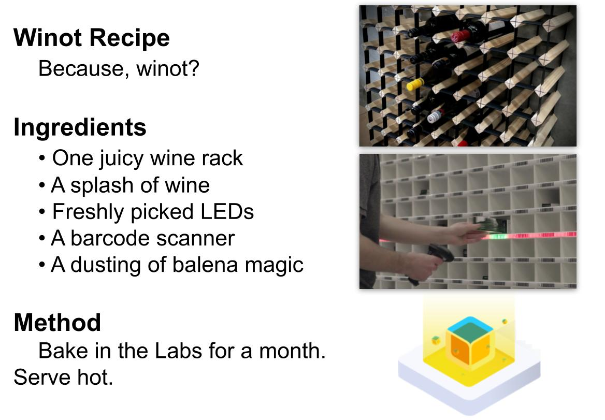
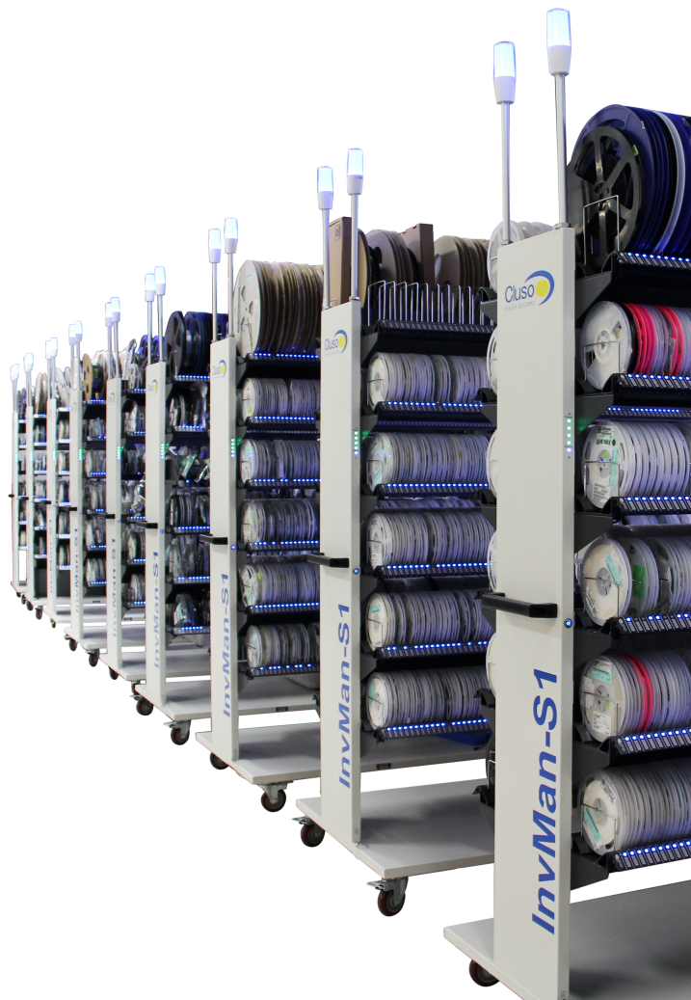
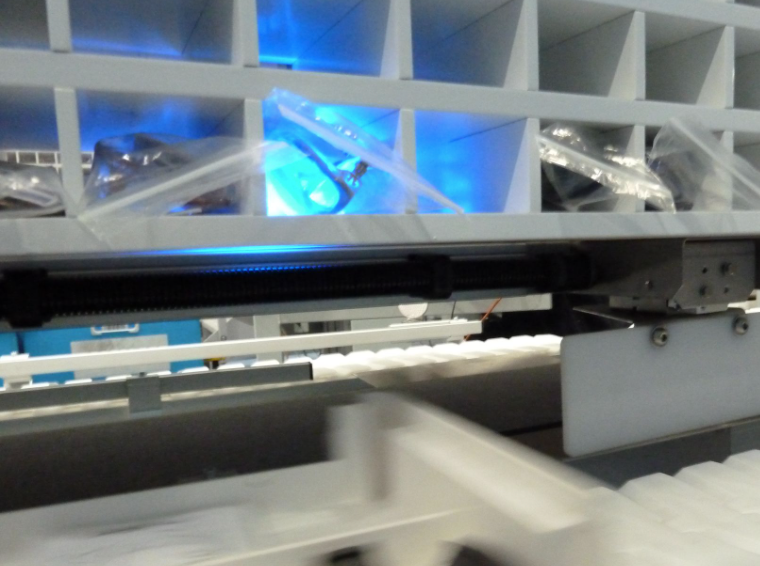

# Winot - Putting the IoT in Wine
## Balena Residency Project

This repository contains the musings, misadventures and measurables from a residency project at balena by Heath Raftery.

Here's to the discovery process.

### Project Attributes

Four weeks to commit to a project of one's own choosing - a dream come true for a insatiably curious engineer! But how to pin down just one project? These were the attributes that guided me:

1. Don't solve anything important.
	- The residency program is first and foremost a learning exercise. Any resulting utility is a bonus. I've learnt many times that when putting together short projects, the best learning comes from questions, not answers. Projects that set out to solve a problem in the world inevitably find that few interesting problems are skin-deep, and it becomes very hard to divorce the value of the project from its ultimate efficacy. Impactful problem solving requires a deep understanding of the problem and who it affects, and relatively little about the technology and tools that go into it.
	- On the other hand, putting delight first tends to invite divergent thinking, stimulating wonder, play and conversation, all of which are brilliant building blocks for learning.
	- In the ideation phase I often say we should avoid the temptation to jump to solutions, lest we stifle good ideas that need some time. Removing the pressure to solve something is a handy trick to ensure ideas have the opportunity to arise and percolate. And so, the first attribute of this project is remember that although Panadol fixes things, wine gets more people talking.
1. Be tangible.
	- There is lots of meaningful infrastructure work to be done. An enabler always has more impact than an end product. But enablers require a lot more mental work from the audience to join the dots and see value.
	- Enablers are also never finished, and things only get worse if they actually turn out to be useful.
	- On the other hand, a physical proof of concept, warts included, has an obvious early milestone (the demo!) which serves as a useful stopping point for further discussion.
1. Be my own user.
	- Good product design requires great user research. But those activities don't bring much to the residency project.
	- Instead, simplify the undertaking by building something that I can use. Interest beyond that should be an emergent property, not a designed one.
1. Be fresh.
	- Naturally I have no shortage of half-baked projects waiting for a new lease on life. But they all carry context that will require some adaptation. The result is a project that awkwardly governed by competing pressures.
	- Instead, maximise the value of the project by starting fresh, favouring without conflict the purposes of the profect.

### Project Candidates

- IoT button for family chores. Eg. tap when done to unlock the TV or iPad.
	- Love anything related to family stress-relief or time-saving. And IoT buttons capture for me the magic of the tangible - a supremely simple device, but powerful habit forming results.
	- Fails #1: too important and deep a problem to try to solve. 
	- Fails #3: my children are too young to have chores, and coming up with something useful to the family is a overwhelming prospect!
- Availability/mood status for co-working / home office setups. Eg. a little digital sign that shows others whether you're in Do-Not-Disturb mode or not.
	- Love this realm of social norms in the new world.
	- Fails #1: so important that there's dozens of so-so "solutions".
	- Fails #3: highly context-sensitive so I'm unlikely to adopt any particular solution.
- Indoor/outdoor air quality sensor to show "ventilation" metric as a relative measure, rather than just a scary number. Are we getting enough "fresh air" to fend off CO2 poisoning or COVID-19 badness.
	- Fails #1 and #3.
- Home ID. Create a system that means households, instead of individuals, can hold accounts such as electricity or, most importantly, home automation services.
	- Fails #1, #2 and #4.
- Robotic lifters for stranded vehicles to rapidly clear accident sites and restore traffic.
	- Fails #1, #3 and #4.
- Smart farm kit for schools.
	- Fails #3 and #4.

### The Leading Candidate

And the winner?

- A inventory management system for the home wine amateur.
	- As you put wine into your rack, scan it first, the data will be added and the appropriate slot will be illuminated. Then when you go to grab a wine for dinner, ask Siri for a recommendation and she'll highlight choices that pair with your meal. You pick one, scan it out, and you'll hear tasting notes / origin story.

---

---

#### Avenues for consideration

- Share your library of wines with house guests and let them pick a wine rather than bringing one you don't like!
- Be more conscious with your wine appreciation by selecting wines rather than simply going through them top to bottom.
- Mark your favourite wines at the moment of enjoyment, rather than trying to recall them when you're buying your next dozen.
- We remember experiences better than names, so recall your favourite wines by reviewing your wine history instead of trying to remember what was on the label.
- Never let a maturing wine go to waste! Reminders and stock tracking to ensure the good stuff gets drunk.
- Team up with the Hone Liquid lads to put spectroscopy based analysis in the hands of the home connoisseur!
- Plugins to services like [CellarTracker](https://www.cellartracker.com) to share experiences.
- Spare barcodes for cleanskin bottles.

#### Enabling technology

- Barcodes (1D, 2D and RFID) are an underappreciated technology. Classic example of boring, old and unnecessarily pigeon-holed. Potential to get it out of the supermarkets and into the hands of innovators.
	- Eg 1: we had 500 people over the course of a week control enormous colourful tree lights using origami flowers that had RFID tags inside them. Magical action at a distance. https://www.instagram.com/p/B5JKPK9Aufn/
	- Eg 2: barcodes are often used to great effect in semi-automated assembly lines, not just for identification but for command entry, since they can reliably encode arbitrary data. A barcode scanner is very simple to operate in those sorts of environments, and process improvements need only a new barcode sticker printed. https://www.youtube.com/watch?v=SBIH4aiTjug
	- Oh yeah, and for better or worse, COVID-19 taught everyone what a QR code is.

#### Risks

- Just how much information can be gleaned by the standard issue barcode? Is the database of identifiers available?
	- Hmm, challenge: "There is no compulsory (or comprehensive) barcode database for alcohol products or any other retail product in Australia or worldwide." [Ref](https://barcodesaustralia.com/barcodes-for-wine/)
	- [International Barcodes Database](https://barcodesdatabase.org) - searchable database. Turns out a small fraction of barcodes are in the database!
	- [GS1](https://www.gs1au.org) - major barcode issuer in Australia.
		- [Barcodes Australia](https://barcodesaustralia.com/barcodes-for-wine/) - a smaller issuer? Has a useful FAQ about barcodes on alcohol.
		- [Hally Labels](https://www.hallylabels.com/labels-blog/wine-labelling-resources-you-need-to-know-the-complete-list/) - ditto
	- [CellarTracker](https://support.cellartracker.com/article/10-about-upc-and-ean-barcodes) - an wine rating app that happens to have assembled "one of the largest wine databases" with 1.2 million barcodes, but warns that barcodes aren't a 100% reliable way of identifying a wine.
		- Gets [lots of requests](https://www.cellartracker.com/forum/tm.asp?m=24391) to access that database via API and is working on it.
	- [Vinloco](https://www.vinloco.com) - another wine rating app, so may have a database.
	- [Naked Wines - Q&A on scanning barcodes](https://www.nakedwines.com/wall/single_view.htm?threadId=108341763&cid=UK) - 6 year old but very relevant discussion on apps that recognise wine barcodes.
		- [Vivino](https://www.vivino.com/AU/en) - most popular suggestion.
		- [Delectable](https://delectable.com) - next most popular.
			- Label only, not barcode.
	- [Corkz](https://apps.apple.com/app/apple-store/id294379127) - seems to add barcode scanning to CellarTracker and ViVino too.
- Individual wine slot illumination might result in a rats nest of cabling.
- Is there a strong enough use case for enabling fleet/multiple site management?

### Inspiration

- The [InvMan S-1](https://www.cluso.com.au/invman) from Cluso Vision Systems by our friends at CircuitWise.

- The [Pick To Light](https://www.monk-conveyors.com/pick-to-light/) system from Monk Conveyors

- Turns out inventory solutions are sought after! And naturally, the Internet sees "apps" as the solution. Yep, another boring database to maintain by "entering all of your bottles into a large spreadsheet", or "organising you wine by producer, varietal or vintage". I'm falling asleep at the thought of it.
	- [Found a wine management software yet](https://www.winecellarinnovations.com/blog/2010/10/06/found-a-wine-management-software-yet/)
	- [How to take wine inventory](https://home.binwise.com/blog/how-to-take-wine-inventory)
	- [How to Use a Wine Cellar Tracking App to Inventory and Barcode Your Wine Collection](https://blog.vinfolio.com/2017/06/28/use-wine-cellar-tracking-app-inventory-barcode-wine-collection/)
- 