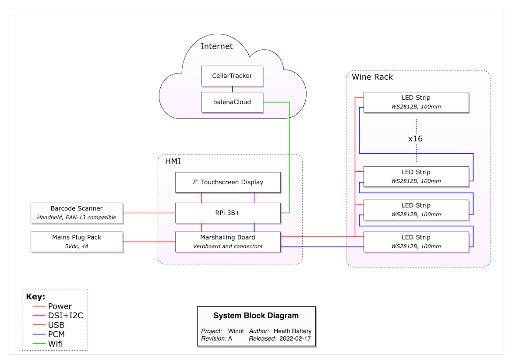

# Winot - Putting the IoT in Wine
## Balena Residency Project

This repository contains the musings, misadventures and measurables from a residency project at balena by Heath Raftery.

Here's to the discovery process.


## Table of Contents
-   [Project Selection](#project-selection)
    -   [Project Attributes](#project-attributes)
    -   [Project Candidates](#project-candidates)
    -   [The Leading Candidate](#the-leading-candidate)
-   [Project Exploration](#project-exploration)
    -   [Avenues for consideration](#avenues-for-consideration)
    -   [Benefits](#benefits)
    -   [Enabling technology](#enabling-technology)
    -   [Major Risks](#major-risks)
        -   [Risk 1: Dataset Availability](#risk-1-dataset-availability)
            -   [Outcome](#outcome)
            -   [Residual Risks](#residual-risks)
            -   [References](#references)
        -   [Risk 2: Pocket Illumination](#risk-2-pocket-illumination)
            -   [Outcome](#outcome-1)
            -   [Calculations](#calculations)
            -   [Form Factor](#form-factor)
            -   [References](#references-1)
    -   [CellarTracker Interaction](#cellartracker-interaction)
    -   [Inspiration](#inspiration)
-   [Project Design](#project-design)
    -   [System Block Diagram](#system-block-diagram)
    -   [BOM](#bom)
    -   [Software Architecture](#software-architecture)
-   [Project Build](#project-build)

---

# Project Selection

## Project Attributes

Four weeks to commit to a project of one's own choosing - a dream come true for a insatiably curious engineer! But how to pin down just one project? These were the self-imposed attributes that guided me:

1. Don't solve anything important.
	- The residency program is a learning exercise. Any resulting utility is a bonus. I've learnt many times that when putting together short projects, the best learning comes from questions, not answers. Projects that set out to solve a problem in the world inevitably find that few interesting problems are skin-deep, and it becomes very hard to divorce the value of the project from its ultimate efficacy. Impactful problem solving requires a deep understanding of the problem and who it affects, and relatively little about the technology and tools that go into it.
	- On the other hand, putting delight first tends to invite divergent thinking, stimulating wonder, play and conversation, all of which are brilliant building blocks for learning.
	- In the ideation phase I often say we should avoid the temptation to jump to solutions, lest we stifle good ideas that need some time. Removing the pressure to solve something is a handy trick to ensure ideas have the opportunity to arise and percolate. And so, the first attribute of this project is remember that although Panadol fixes things, wine gets more people talking.
1. Be tangible.
	- There is lots of meaningful infrastructure work to be done. An enabler always has more impact than an end product. But enablers require a lot more mental work from the audience to join the dots and see value.
	- Enablers are also never finished, and things only get worse if they actually turn out to be useful.
	- On the other hand, a physical proof of concept, warts included, has an obvious early milestone (the demo!) which serves as a useful stopping point for further discussion.
1. Be my own user.
	- Good product design requires great user research. But those activities don't bring much to the residency project.
	- Instead, simplify the undertaking by building something that I can use. Interest beyond that should be an emergent property, not a designed one.
1. Be fresh.
	- Naturally I have no shortage of half-baked projects waiting for a new lease on life. But they all carry context that will require some adaptation. The result is a project that awkwardly governed by competing pressures.
	- Instead, maximise the value of the project by starting fresh, favouring without conflict the purposes of the profect.

## Project Candidates

- IoT button for family chores. Eg. tap when done to unlock the TV or iPad.
	- Love anything related to family stress-relief or time-saving. And IoT buttons capture for me the magic of the tangible - a supremely simple device, but powerful habit forming results.
	- Fails #1: too important and deep a problem to try to solve. 
	- Fails #3: my children are too young to have chores, and coming up with something useful to the family is a overwhelming prospect!
- Availability/mood status for co-working / home office setups. Eg. a little digital sign that shows others whether you're in Do-Not-Disturb mode or not.
	- Love this realm of social norms in the new world.
	- Fails #1: so important that there's dozens of so-so "solutions".
	- Fails #3: highly context-sensitive so I'm unlikely to adopt any particular solution.
- Indoor/outdoor air quality sensor to show "ventilation" metric as a relative measure, rather than just a scary number. Are we getting enough "fresh air" to fend off CO2 poisoning or COVID-19 badness.
	- Fails #1 and #3.
- Home ID. Create a system that means households, instead of individuals, can hold accounts such as electricity or, most importantly, home automation services.
	- Fails #1, #2 and #4.
- Robotic lifters for stranded vehicles to rapidly clear accident sites and restore traffic.
	- Fails #1, #3 and #4.
- Smart farm kit for schools.
	- Fails #3 and #4.

## The Leading Candidate

And the winner?

- A inventory management system for the home wine amateur.
	- As you put wine into your rack, scan it first, the data will be added and the appropriate slot will be illuminated. Then when you go to grab a wine for dinner, ask Siri for a recommendation and she'll highlight choices that pair with your meal. You pick one, scan it out, and you'll hear tasting notes / origin story.

---


---

# Project Exploration
## Avenues for consideration

- Share your library of wines with house guests and let them pick a wine rather than bringing one you don't like!
- Be more conscious with your wine appreciation by selecting wines rather than simply going through them top to bottom.
- Mark your favourite wines at the moment of enjoyment, rather than trying to recall them when you're buying your next dozen.
- We remember experiences better than names, so recall your favourite wines by reviewing your wine history instead of trying to remember what was on the label.
- Never let a maturing wine go to waste! Reminders and stock tracking to ensure the good stuff gets drunk.
- Team up with the Hone Liquid lads to put spectroscopy based analysis in the hands of the home connoisseur!
- Plugins to services like [CellarTracker](https://www.cellartracker.com) to share experiences.
- Spare barcodes for cleanskin bottles.

## Benefits

- Drink more consciously by selecting wines rather than working through them sequentially.
- Develop tastes and preferences by closing the loop on the drinking experience with tasting notes.
- Track your drinking habits to make more informed choices.
- Build a collection with purpose - a wine for every occassion.
- Delight friends and spark conversations at dinner parties.

## Enabling technology

- Barcodes (1D, 2D and RFID) are an underappreciated technology. Classic example of boring, old and unnecessarily pigeon-holed. Potential to get it out of the supermarkets and into the hands of innovators.
	- Eg 1: we had 500 people over the course of a week control enormous colourful tree lights using origami flowers that had RFID tags inside them. Magical action at a distance. https://www.instagram.com/p/B5JKPK9Aufn/
	- Eg 2: barcodes are often used to great effect in semi-automated assembly lines, not just for identification but for command entry, since they can reliably encode arbitrary data. A barcode scanner is very simple to operate in those sorts of environments, and process improvements need only a new barcode sticker printed. https://www.youtube.com/watch?v=SBIH4aiTjug
	- Oh yeah, and for better or worse, COVID-19 taught everyone what a QR code is.


## Major Risks

1. Just how much information can be gleaned by the standard issue barcode? Is the database of identifiers available?
	- See [Dataset Availability](#risk-1-dataset-availability).
1. Individual wine slot illumination might result in a rats nest of cabling.
	- See [Pocket Illumination](#risk-2-pocket-illumination).
1. Is there a strong enough use case for enabling fleet/multiple site management?

### Risk 1: Dataset Availability

Hmm, we have a [problem](https://barcodesaustralia.com/barcodes-for-wine/):

> "There is no compulsory (or comprehensive) barcode database for alcohol products or any other retail product in Australia or worldwide." 

Turns out the best databases are crowd-sourced. Data is spotty. Accessing it will require jumping some unclear API hurdles.

**Assessment: high risk.**

Research was illuminating but not conclusive. On to experimentation. Results are that CellarTracker can be successfully searched by UPC (for free). Vivino can't. So CellarTracker is only option. [Alas](https://www.cellartracker.com/forum/fb.asp?m=339810):

> I have had a few API consumers who have tried to use the API as a backdoor to try and steal large swathes of my wine database (no user data) or generally create inadvertent denial of service issues. They have ruined the party for everyone else. So I am not interested in providing any further access to my API except in the context of a much larger business discussion. I have a few such partners (e.g. Cor.kz, CellarVU, WineGlass), but generally those are very time consuming relationships to setup. So while I am open to receiving email about potential partnerships, at this point I am (a) not interested in having coffee or conference calls with everyone who is interested (about 10 such approaches per week), (b) not interested in opening up a general purpose API, (c) and not interested in selling or licensing my database.

#### Outcome

I think I see a profitable way forward. If can't beat them, join them. See [CellarTracker Interaction](#cellartracker-interaction).

#### Residual Risks

- User session management. Cookies? Authentication?
- Discoverability, stability and utility of undocumentated URL scheme.

#### References

- [International Barcodes Database](https://barcodesdatabase.org) - searchable database. Turns out a small fraction of barcodes are in the database!
- [GS1](https://www.gs1au.org) - GS1 is the umbrella standard for UPC/EAN/etc. GS1 Australia is a major barcode issuer in Australia.
	- [Barcodes Australia](https://barcodesaustralia.com/barcodes-for-wine/) - a smaller issuer? Has a useful FAQ about barcodes on alcohol.
	- [Hally Labels](https://www.hallylabels.com/labels-blog/wine-labelling-resources-you-need-to-know-the-complete-list/) - ditto
- [CellarTracker](https://support.cellartracker.com/article/10-about-upc-and-ean-barcodes) - an wine rating app that happens to have assembled "one of the largest wine databases" with 1.2 million barcodes, but warns that barcodes aren't a 100% reliable way of identifying a wine.
	- Gets [lots of requests](https://www.cellartracker.com/forum/tm.asp?m=24391) to access that database via API and is working on it.
	- These days recommends and heavily supports printing your own barcodes that are specifically linked to entries in the CT database. How redundant that is is not clear.
- [Vinloco](https://www.vinloco.com) - another wine rating app, so may have a database.
- [Naked Wines - Q&A on scanning barcodes](https://www.nakedwines.com/wall/single_view.htm?threadId=108341763&cid=UK) - 6 year old but very relevant discussion on apps that recognise wine barcodes.
	- [Vivino](https://www.vivino.com/AU/en) - most popular suggestion.
	- [Delectable](https://delectable.com) - next most popular.
		- Label only, not barcode.
- [Corkz](https://apps.apple.com/app/apple-store/id294379127) - seems to add barcode scanning to CellarTracker and ViVino too.
	- Ah okay, relationship seems to be: CT and Vivino have separate databases, but CT uses Vivino to provide *label* (image) identification. CT has its own barcode identification and mobile app functionality, so doesn't need Corkz any more. But Corkz can still be used to provide mobile access to your CT account.
- [Untappd](https://untappd.com)
	- Same story, but beer: "created its own barcode database based on brewers submission and/or crowdsourced from users. It seems to work really well in my experience, but did require years of growth".

### Risk 2: Pocket Illumination

How to install and drive individual, coloured, low-UV (to avoid spoiling) illumination of wine rack pockets?

- Cabling is looking dead in the water - would either be tremendously unsightly or require drilling into walls. Either option manageable for permanent installs, but scores poorly on the WAF for a MVP.
- Wireless has serious challenges. Need uniquely addressable and non-line-of-sight, so IR is out. Market is swamped with IR, but nothing suitable with RF. Is it even feasible to leave a battery powered light on in RF receive mode? Lighting duty is very low, but useful figure for 433MHz receive mode is 4mA continuous. That's 250 hours for a 1000mAh AA battery. That's 10 days. With polling could get 10x easily. 100x (listen for 5ms every 500ms) is possible.
	- This sounds like a project in itself. Perhaps a worthwhile one. Maybe phase 2, and make do with cables and hand-waving for now?

#### Outcome

After some experimentation, I have decided:

- standalone lights are a really interesting path to pursue, with potential of its own. But for now, running down dozens of batteries and debugging wireless gremlins is too much scope to deal with. I cannot find a way to justify the cost, maintenance and installation requirements of batteries in the order of 3 AAA's per pocket.
- wired lights, with some very discreet holes in the wall, eliminates too many unknowns to pass up for version 1.
- addressable LED strip is:
	- widely available;
	- reduces cabling to 3 wires in total;
	- has predictable and pleasing aesthetics;
	- comes with suitable adhesive mounting method;
	- can be cut and re-connected for passing through holes and around corners

#### Calculations

My wine rack provides a useful set of design parameters.

- 16 pockets
- Each pocket measures 118x112x295 (WxHxD) internal.
- WS2815 is 12V, WS2812B is 5V.
	- 5V will require power injection every 3-5m.
	- WS2815 has 4 fourth wire for failed LED backup.
	- WS2811 is also 12V, but LEDs are controlled in groups of 3, not individually... which might be all we want.
- Strips are typically 30, 60, 100 or 144LEDs/m, which is 3, 6, 10 or 14 RGB LEDs per 100mm.
	- 60LEDs/m strips have 17mm cuttable sections (102mm for 6).
- LEDs are 60mA max (20mA each for R, G and B).
	- So for 16 pockets with 100mm of LEDs, works out to be 1A max for each LED in a pocket. So for 3 LED pocket, 3A. For 10 LED pockets, 10A.
		- For one pocket at a time operation: 120mA, 240mA, 600mA, 840mA.
- 5V WS2812B strips are far easier to source, and we only have about 1.6m of actual LEDs, so maybe 12V not important. Will all the cutting and wiring affect that?
	- But still, hard to supply max current.
	- Relatively easy to source a 5V, 4A wall wart. Beyond 4A it'd be a separate supply.
	- A Pi3 + 7" touchscreen will be 750mA continuous.
	- So we could possibly run a 30LEDs/m strip flat out, or a 60LEDs/m if only half the LEDs are on at once.

#### Form Factor

Essential criteria are:

- subtle impact on rack aesthetics
- great lighting effect - this is the money shot opportunity
- don't interfere with rack function

Desirable criteria are:

- leave no trace when removed
- inexpensive, since this is the part that needs to scale
- can be adapted to other wine rack styles

The rack pockets are deep and nearly square. The bottles are round and are typically a tad longer than but not as wide as the pockets. Occassionally though, bottles do come close to filling the pocket height.

Options:

1. Dome light in ceiling of pocket.
	- Standalone lights are often this form factor, and is a common way to light trophies or other recessed displays.
	- But in our case the "trophy" is laid flat, plus we don't have much room to spare here and it will likely get bumped or obscured.
1. Something on the back wall - in a corner or along an edge.
	- Difficult to avoid shining in to user's eyes from some angle.
1. LED strip across ceiling of pocket, part way down.
	- Allows "in" wiring and "out" wiring to run down either side of the pocket.
	- With experimentation, could find optimal placement down depth of pocket.
	- Ensures some light on bottle and some for the pocket.
	- Highly symmetrical aesthetics.
	- But requires two holes in the back of each pocket, and still might get bumped when inserting/removing wine.
	- Also has unpredicable visual effects based on proximity of bottle, all the way from absent to right next to part of the strip.
	- 
1. LED strip part way along one or both top edges.
	- Guaranteed to be out of way of bottle, since bottle is round in a squarish hole.
	- Requires "in" and "out" wiring to be doubled back on itself.
	- Symmetry requires double the effort. Asymmetry only requires one hole.
	- Basic animation is possible, since we have depth?
	- Could do bottom edges for easier mounting but aesthetics "feel" like they would be poorer.
	- 


#### References

This is the sort of thing that is widely [available](https://www.jhmarket.com.au/leastyle-battery-operated-led-under-counter-lights-in-black-pack-of-6.html?gclid=Cj0KCQiAmKiQBhClARIsAKtSj-m5L7Szz0UcwTkiGnD8J5Tqh03MxcRDMQeKKnfYdnlQTA6yK28qMEcaAsgMEALw_wcB) and cheap. But is IR, so a deadend. And it's a bit bulky.


[This](https://www.ebay.com.au/itm/261835853404) is 433MHz and getting close but requires 12V power.

## CellarTracker Interaction

Risk reduction activities revealed that the biggest risk was in fact, a big hairy potential showstopper. The project premise assumes there's some publicly accessible dataset of barcode to wine relationships. Because surely every retailer doesn't create their own in private, right? Turns out there's [nothing even close](risks), and even if there was, it wouldn't always uniquely identify wines. I guess that's why they called it a Universal Product Code and not a Globally Unique Identifier...

It turns out the world's best database for wine identification is a proprietary, largely crowd-sourced, for-profit effort that drives a website called CellarTracker. And the owner [got burnt](https://www.cellartracker.com/forum/fb.asp?m=339810) trying to provide a public API and has closed the door.

A Raspberry Pi based web browser that allows the user to use CellarTracker hardly sounds like a ground-breaking IoT project, so Winot is looking shakey. I'm allergic to "there's an app for that" reductionism and always think physicality first, so just another web app would be a failure in my eyes. Except...

- A proprietary, crowd-sourced dataset is a healthy indicator of a vibrant community of users who see value in that data. 
- The data is high quality, continually checked and updated, with metadata like reviews and prices.
- CellarTracker already does the finicky and non-novel account/inventory management stuff.
- And, if I take as a design constraint that the wine database is proprietary, all I *really* need to do the headline Winot features of:
	- local control of pocket lights, and
	- semi-automated entry of wine data;
- is a read and submission entry point to the user's cellar data respectively. [Ooops](https://www.cellartracker.com/forum/printable.asp?m=443838), looks like we can fumble our way there. Experimentation results are favourable - might have to do some non-ideal things like polling and hand-off to the website, but with a bit of UX grease, these constraints can become nearly invisible. The key is to swim with CellarTracker, not perpendicular to it, and do better together.

It would look a little something like this:


## Inspiration

- The [InvMan S-1](https://www.cluso.com.au/invman) from Cluso Vision Systems by our friends at CircuitWise.

- The [Pick To Light](https://www.monk-conveyors.com/pick-to-light/) system from Monk Conveyors


- Turns out inventory solutions are sought after! And naturally, the Internet sees "apps" as the solution. Yep, another boring database to maintain by "entering all of your bottles into a large spreadsheet", or "organising you wine by producer, varietal or vintage". I'm falling asleep at the thought of it.
	- [Found a wine management software yet](https://www.winecellarinnovations.com/blog/2010/10/06/found-a-wine-management-software-yet/)
	- [How to take wine inventory](https://home.binwise.com/blog/how-to-take-wine-inventory)
	- [How to Use a Wine Cellar Tracking App to Inventory and Barcode Your Wine Collection](https://blog.vinfolio.com/2017/06/28/use-wine-cellar-tracking-app-inventory-barcode-wine-collection/)


# Project Design

Having explored the major risks and constraints, it's now time to come up with a design.

## System Block Diagram



## BOM


[Source](https://docs.google.com/spreadsheets/d/1Vril53xEtRFOpUpF5h6KM9TFz6D7Ar1aQKYEL28-_Lo/edit?usp=sharing)

## Software Architecture


# Project Build

With enough design down on paper to see how all the pieces will fit together, it's time to chase out the design flaws by putting some pieces together!

With the BOM ordered and parts trickling in, I turned to software development. To make sure I was taking advantage of the balena platform, I ran through the [getting-started](https://www.balena.io/docs/learn/getting-started/raspberrypi3/nodejs/) tutorial and then realised you can choose your own adventure by language and platform like [this](https://www.balena.io/docs/learn/getting-started/raspberry-pi2/haskell/)! I followed that with the guides on [local mode](https://www.balena.io/docs/learn/develop/local-mode) and [multiple containers](https://www.balena.io/docs/learn/develop/multicontainer).

With that I had a great grasp of how balenaCloud was going to power my application, but I was still reaching for some sort of guidance on a dev environment that would give me the GPIO twiddling power I craved without putting barriers in place when I want to add a HTTP API interface layer to leverage the *services* model that balena empowers. I've spent decades in C based IDEs writing firmware for microcontrollers, cut Python on SBCs to do physical computing, dabbled in Node.js et al for simple user front ends, and consumed a new programming language every couple of years. But now I realise that in coming from a embedded background, this is still new territory - how to transition to what is well encapsulated by the nebulous term, *edge computing*. How do I apply my hardware-centric perspective to a world of containerised apps that drive hardware from a webapp-centric perspective?

Eventually I stumbled on [this](https://www.balena.io/blog/interfacing-balena-edge-devices-with-adafruitio/) and the pieces started to fall together. For better or worse, the marvellous glue language, Python, is the defacto tool for bridging the physical device with the ephemeral cloud. Seeing that a fellow balenista had a (not necessarily ideal) path to success gave me the gumption to bury my reservations about using a dynamic, jack-of-all trades scripting language for *work*, and just get on with it. Extolling the virtues of a Better Way can wait until I get some damn LEDs flashing! Perhaps at that point it may not seem so important.

Now to get started... I realise I've started with the wrong repo template. I'm now creating an app, so I need whatever is required for `balena push` to work. But it's not clear to me how `balena push` turns into something that fires up docker on the device. Maybe `balena push` uploads the entire working folder somewhere and then calls `docker build` on that folder. That would mean two things:

1. managing git is entirely separate. That is, `balena push` and `git push` are unrelated and can operate in different cycles.
2. the entire working copy is acted upon, so anything is fair game, including using `.dockerignore` to limit what `docker build` uses.

Oh great, this is almost exactly what [this](https://www.balena.io/docs/learn/deploy/deployment/) says. Oh that page answers allll my questions. Required reading methinks!

Finally, I'm ready to create a starting repo. What would be really awesome is a document pointing out the purpose of every possible file in a balena app repo skeleton. Just enough to know who it's for so the reader can then use existing knowledge or additional docs to piece the whole thing together.

Alright, got a hello world repo going from the ground up! Now we're underway.

Thinking about a suitable API for `led-strip-driver`. What have others done? `esp8266-fastled-webserver` is a popular example. But the API doesn't appear to be documented! Reading [esp8266-fastled-webserver.ino](https://github.com/jasoncoon/esp8266-fastled-webserver/blob/1b8929c86eb7d42233ff48b41c7c7d516ac8213f/esp8266-fastled-webserver/esp8266-fastled-webserver.ino) suggests it's quite complicated and not very generic:

- GET all|product|info|fieldValue|etc
- POST fieldValue|power|cooing|sparking|speed|etc...

Reminds me of the RGB LED Obelisk we did! Defining "patterns" is complex.

Although it's not as powerful, I think I just want a `off` and `setLED` API for now. That is, just the ability to turn individual pixels to a certain colour.

Eh, so little guidance on a suitable API for what is essentially an array of ints (LED RGB values). REST is really designed for CRUD, and adaptations to plain old get/set operations are a wide variety of commonly accepted bastardisations of the verbs. Here's the [standard](https://restfulapi.net/rest-put-vs-post/) purpose of PUT and POST, but the world has realised that there's lots more use cases than that and the extensions are common and fractured.

Best options:

1. Copy `esp8266-fastled-webserver`. Way too hard for now.
2. Use the LED position as the resource id, and limit to Read and Update operations on either all or one LED. Eg. `GET /leds` , `GET /leds/{id}`, `PUT /leds` and `PUT /leds/{id}`.
3. Specify the LED position as an option parameter with the default being all, and use the common bastardisation of comma delimited multiple parameter values. Eg. `GET /leds`, `PUT /leds?pos=5,6,7,8&colour=#336699`.

On reflection, #3 doesn't provide enough power to warrant the non-standardness. Instead, starting with #2 is simple, easy to understand and will provide a certain amount of functionality. It can then be extended with specific functions that provide more powerful functionality, until it's eventually `esp8266-fastled-webserver` compatible.

Oh [rpi-ws2812-server](https://github.com/tom-2015/rpi-ws2812-server) is an impressive feature rich web server for controlling ws2812 and similar LED arrays.

Eh, Flask [auto-converts](https://flask.palletsprojects.com/en/2.0.x/api/#flask.Flask.make_response) the `dict` *response* you provide into JSON (it jsonifies it). Doesn't say what it does to a `list`. Also, JSON can only support strings as keys, and list, dictionary, string, integer, float, boolean or Null as values (eg. no tuples). Only decimal integers are supported.

To make life as easy as possible, we could pick `0xWWRRGGBB`, which matched the [Arduino NeoPixel lib](https://github.com/adafruit/Adafruit_NeoPixel/blob/master/Adafruit_NeoPixel.h#L352).

Getting started with `rpi-ws281x-python`:

```
$ python
import rpi_ws281x
strip = rpi_ws281x.PixelStrip(5, 21)
strip.begin()
strip.setPixelColor(1, rpi_ws281x.Color(255,0,0))
strip.show()
```

And fancier (a selection from [strandtest.py](https://github.com/rpi-ws281x/rpi-ws281x-python/blob/master/examples/strandtest.py)):

```
import time
from rpi_ws281x import Color

def wheel(pos):
    """Generate rainbow colors across 0-255 positions."""
    if pos < 85:
        return Color(pos * 3, 255 - pos * 3, 0)
    elif pos < 170:
        pos -= 85
        return Color(255 - pos * 3, 0, pos * 3)
    else:
        pos -= 170
        return Color(0, pos * 3, 255 - pos * 3)

def theaterChaseRainbow(strip, wait_ms=50):
    """Rainbow movie theater light style chaser animation."""
    for j in range(256):
        for q in range(3):
            for i in range(0, strip.numPixels(), 3):
                strip.setPixelColor(i + q, wheel((i + j) % 255))
            strip.show()
            time.sleep(wait_ms / 1000.0)
            for i in range(0, strip.numPixels(), 3):
                strip.setPixelColor(i + q, 0)

theaterChaseRainbow(strip)
```

I wanted to auto-document the API and got the hot tip from a colleague that fastapi >> Flask for that and other RESTful things. The Internet strongly agrees:

- Old [hotness](https://stackoverflow.com/questions/14295322/what-tools-are-available-to-auto-produce-documentation-for-a-rest-api-written-in)
- New [hotness](https://stackoverflow.com/questions/67849806/flask-how-to-automate-openapi-v3-documentation)

So I bit the bullet and ported it over. Muuuuch better.

- [Swagger UI](https://5fba0b0e46ba6ea4f1cfb5e40f3183a7.balena-devices.com/docs)
- [ReDoc](https://5fba0b0e46ba6ea4f1cfb5e40f3183a7.balena-devices.com/redoc)
- And now, best of both with [redoc try](https://5fba0b0e46ba6ea4f1cfb5e40f3183a7.balena-devices.com/redoc-try)

`led-strip-driver` is done! Does all I need at the moment. On to the "app" that provides the user interface.

Obvious choice is a web app, as outlined in the [Software Architecture](#software-architecture) diagram. First step - what's the kiosk going to be? Posed this question on Flowdock:

---
I’m looking for guidance on a starting point to create a kiosk app on the Raspberry Pi 7” Touchscreen.

Pre-balena I’ve done this a few times with a minimal window manager, chromium and a startup script with a bunch of options to make it kiosky and do power management. Now I want to go non-DIY and leverage the balena-verse. I’m not even wedded to a browser and happy to write my UI in just about anything, provided I can show a few buttons, a hideable on-screen keyboard, and a webview.

So far I’ve seen:

- [balenalabs/balena-dash](https://github.com/balenalabs/balena-dash)
- [Igalia/balena-wpe](https://github.com/Igalia/balena-wpe)
- [balenalabs-incubator/balena-wpe](https://github.com/balenalabs-incubator/balena-wpe)
- [balenablocks/electron](https://github.com/balenablocks/electron)
- [jayatvars/balena-chromium-kiosk](https://github.com/jayatvars/balena-chromium-kiosk)
- [balenablocks/browser](https://github.com/balenablocks/browser)
- [mir-kiosk](https://snapcraft.io/blog/mir-kiosk-uses-mir)

and am having a hard time figuring out how to avoid deep exploratory rabbit holes.

---

Responses indicate `balenablocks/browser` will do just fine, which makes sense. Feel like I'm missing out on wpe/electron/mir, but maybe they're just distractions.

With the client sorted, on to the app itself. Oh boy. Do I want a web app, a Progressive Web App or a Single Page App? Do I get with the times and use JavaScript + React. Or get ahead of the curve with TypeScript and Svelte? Or do just stick with Python + Django or my mate Flask? What about vanilla JS or even something I actually enjoy, like Ruby on Rails?

After *much* Googling and hand-wringing, decided that *if* I was to do a web app, it would be a PWA in Vanilla JS, adding frameworks and tools as I felt the need for them. [This](https://medium.com/james-johnson/a-simple-progressive-web-app-tutorial-f9708e5f2605) would be the starting point.

But then... why do a web app at all? There's so much infrastructure (eg. the server and the client), the landscape is a hot mess, I'm not utilising of any of the advantages, the learning curve is steep and bumpy, none of my preferred languages are well supported, and besides, aren't I contributing to the downfall of modern society by using web technologies when native will do?

What if I did a native app? The options are really:

- C++ and Qt (either QWidgets or QML and Qt Quick)
- Perl/Ruby/Python/C++ and wxWidgets
- Python/C/C++/Rust and GtK
- Python and Tkinter
- Python and Kivy
- Java and Swing/JavaFX
- Pascal and Lazarus (Delphi clone)

The choice is pretty clear to me, given I have some familiarity with everyone of those. Time to fire up **Qt Creator**!

I hate that the first step is always "name your new project". Naming is hard - particularly as the first step! What do you name the app/main/ui service? After some research I see:

- match the fleet name (eg. `inkyshot`)
- `frontend` / `backend`
- `eink`

So am still a bit undecided. Nearly went with `app` to match the Software Architecture diagram, but that term has meaning in the balenaverse. So let's go with... `winot-gui`. Well scoped, nicely descriptive and hints that there should be some separation of concerns, even if nearly all functionality will be in the user interface service to begin with.

Man, that app was *hard*. Everytime I go to do UI I feel like I'm reinventing the wheel, designing buttons and setting spacing and establishing UX. A product of growing up with the Apple HIG? Twas so much simpler back then...

Anyway, after a big slog, a complete V1 of the UI is done. Was brutal getting screens, tables, webviews and other pedestrian crap going. But would have only been worse as a web app, I think. So now ready to draw a line in the sand, and work on integration - getting `winot-gui` off the desktop, and building, deploying and running on balenaOS. Then we get to hook up the UI to the LED driver!

Okay, now to port to Raspberry Pi. Here's goes. Difficult to find guidance which isn't either Qt 5 or RPi 4 specific. It doesn't help that both 64-bit Raspberry Pi OS and Qt 6 are both relatively new. Found two decent guides:

- [Impressive code and guide from Vikto Petersson, CEO of Screenly.io](https://www.docker.com/blog/compiling-qt-with-docker-multi-stage-and-multi-platform/)
- [TalOrg - Building Qt 6.2 on Raspberry Pi OS](https://www.tal.org/tutorials/building-qt-62-raspberry-pi)

Cross-compilation is definitely the *right* way, but I'm going to try building on ARM first. It simplifies a complex problem a lot, and the balena ARM builders may be okay anyway.

First attempt:

```
apt update
apt install build-essential cmake ninja-build libfontconfig1-dev libdbus-1-dev libfreetype6-dev libicu-dev libinput-dev libxkbcommon-dev libssl-dev libpng-dev libjpeg-dev libglib2.0-dev
apt install libgles2-mesa-dev libgbm-dev libdrm-dev
apt install libx11-dev libxcb1-dev libxext-dev libxi-dev libxcomposite-dev libxcursor-dev libxtst-dev libxrandr-dev libx11-xcb-dev libxext-dev libxfixes-dev libxi-dev libxrender-dev libxcb1-dev libxcb-glx0-dev libxcb-keysyms1-dev libxcb-image0-dev libxcb-shm0-dev libxcb-icccm4-dev libxcb-sync-dev libxcb-xfixes0-dev libxcb-shape0-dev libxcb-randr0-dev libxcb-render-util0-dev libxcb-util0-dev libxcb-xinerama0-dev libxcb-xkb-dev libxkbcommon-dev libxkbcommon-x11-dev libxcb-xinput-dev
wget https://download.qt.io/official_releases/qt/6.2/6.2.3/submodules/qtbase-everywhere-src-6.2.3.tar.xz
tar xf qtbase-everywhere-src-6.2.3.tar.xz
```

The guide then says this, but I'm getting nowhere with that, even "fixing" it to the second version:

```
mkdir qtbasebuild && cd qtbasebuild
/opt/cmake/bin/cmake -G Ninja -DCMAKE_INSTALL_PREFIX=/opt/Qt/6.2.3-armv7l -DQT_FEATURE_opengles2=ON -DQT_FEATURE_opengles3=ON -DCMAKE_TOOLCHAIN_FILE=tc.cmake -DQT_AVOID_CMAKE_ARCHIVING_API=ON ../qtbase-everywhere-src-6.2.3
/usr/bin/cmake -G Ninja -DCMAKE_MAKE_PROGRAM=/usr/bin/cmake -DCMAKE_INSTALL_PREFIX=/opt/Qt/6.2.3-armv7l -DQT_FEATURE_opengles2=ON -DQT_FEATURE_opengles3=ON -DCMAKE_TOOLCHAIN_FILE=tc.cmake -DQT_AVOID_CMAKE_ARCHIVING_API=ON ../qtbase-everywhere-src-6.2.3
```

So instead, try to get a vanilla build going first:

```
cd qtbase-everywhere-src-6.2.3
sudo dphys-swapfile swapoff
sudo vi /etc/dphys-swapfile # change CONF_SWAPSIZE to 1024
sudo dphys-swapfile swapon
./configure 
cmake --build . --parallel
```

Note:

- Qt embedded existed in Qt 4, but is now obsolete. I think that goes for OpenGL ES (GLES - OpenGL for Embedded System) too.
- As of Qt 5.0, Qt no longer has its own window system (QWS) implementation. For single-process use cases, the Qt Platform Abstraction is a superior solution; multi-process use cases are supported through Wayland.
- EGLFS is a platform plugin for running Qt applications on top of EGL and OpenGL ES 2.0, without an actual windowing system like X11 or Wayland. It is the recommended plugin for modern Embedded Linux devices that include a GPU.
- *Qt for Device Creation* is a **commercial offering** that provides the Qt development framework for embedded Linux and Real Time Operating Systems (RTOS).
	- Yocto tools and recipes, plus embedded Linux cross-compilation environments for reference devices.
- [Configure an Embedded Linux Device](https://doc.qt.io/qt-6/configure-linux-device.html) is the official place to start.

Given Qt for Device Creation is commercial, I have a feeling the embedded route might be *too hard* and I'm better off pursuing execution on top of Raspberry Pi OS / X11.

Trying cross-compiling on a DigitalOcean beast:

```
ssh root@188.166.216.202
apt update
apt upgrade
apt install build-essential cmake ninja-build libfontconfig1-dev libdbus-1-dev libfreetype6-dev libicu-dev libinput-dev libxkbcommon-dev libssl-dev libpng-dev libjpeg-dev libglib2.0-dev
apt install libgles2-mesa-dev libgbm-dev libdrm-dev
apt install libx11-dev libxcb1-dev libxext-dev libxi-dev libxcomposite-dev libxcursor-dev libxtst-dev libxrandr-dev libx11-xcb-dev libxext-dev libxfixes-dev libxi-dev libxrender-dev libxcb1-dev libxcb-glx0-dev libxcb-keysyms1-dev libxcb-image0-dev libxcb-shm0-dev libxcb-icccm4-dev libxcb-sync-dev libxcb-xfixes0-dev libxcb-shape0-dev libxcb-randr0-dev libxcb-render-util0-dev libxcb-util0-dev libxcb-xinerama0-dev libxcb-xkb-dev libxkbcommon-dev libxkbcommon-x11-dev libxcb-xinput-dev
wget https://download.qt.io/official_releases/qt/6.2/6.2.3/submodules/qtbase-everywhere-src-6.2.3.tar.xz
tar xf qtbase-everywhere-src-6.2.3.tar.xz 
cd qtbase-everywhere-src-6.2.3/
./configure
cmake --build . --parallel
cmake --install .
```

Easy. But useless on its own. Now will it cross compile? Using variations on [this guide](https://wiki.qt.io/Raspberry_Pi_Beginners_Guide) for Qt 5.

```
cd
wget https://downloads.raspberrypi.org/raspios_arm64/images/raspios_arm64-2022-01-28/2022-01-28-raspios-bullseye-arm64.zip
apt install unzip
unzip raspios_arm64-2022-01-28/2022-01-28-raspios-bullseye-arm64.zip
mkdir /mnt/rasp-pi-rootfs
fdisk -l 2022-01-28-raspios-bullseye-arm64.img # note "Start" of Linux partition. Let offset = Start * sector size.
mount -o loop,offset=272629760 2022-01-28-raspios-bullseye-arm64.img /mnt/rasp-pi-rootfs
apt install gcc make gcc-aarch64-linux-gnu g++-aarch64-linux-gnu binutils-aarch64-linux-gnu
rm -R qtbase-everywhere-src-6.2.3
tar xf qtbase-everywhere-src-6.2.3.tar.xz 
```

Okay, how to configure...

See [mkspecs/devices](https://code.qt.io/cgit/qt/qtbase.git/tree/mkspecs/devices) for `-device`. `linux-rasp-pi3-g++` is obvious choice, avoiding `vc4`/`mesa` for now. Bugger, according to [this](https://doc-snapshots.qt.io/qt6-dev/configure-linux-device.html#toolchain-files-versus-device-makespecs) this is "no longer sufficient". Crap "cross-compiling Qt requires a host build of Qt being available". Shouldn't have deleted it!

```
./configure -prefix /opt/qt-host
cmake --build . --parallel
cmake --install .
cd ..
mv qtbase-everywhere-src-6.2.3 qtbase-everywhere-src-6.2.3-host
tar xf qtbase-everywhere-src-6.2.3.tar.xz 
mv qtbase-everywhere-src-6.2.3 qtbase-everywhere-src-6.2.3-cross
mkdir qtbasebuild && cd qtbasebuild
vi ../qtbase-everywhere-src-6.2.3-cross/toolchain.cmake # contents below
../qtbase-cross/configure -nomake examples -nomake tests -qt-host-path ../qtbase-host -prefix /usr/local/qt6 -- -DCMAKE_TOOLCHAIN_FILE=../qtbase-cross/toolchain.cmake -DQT_BUILD_TOOLS_WHEN_CROSSCOMPILING=ON
```

Contents of `toolchain.cmake`:

```
cmake_minimum_required(VERSION 3.16)
include_guard(GLOBAL)

set(CMAKE_SYSTEM_NAME Linux)
set(CMAKE_SYSTEM_PROCESSOR arm)

set(TARGET_SYSROOT /mnt/rasp-pi-rootfs)
set(CROSS_COMPILER /usr/bin)

set(CMAKE_SYSROOT ${TARGET_SYSROOT})

set(ENV{PKG_CONFIG_PATH} "")
set(ENV{PKG_CONFIG_LIBDIR} ${CMAKE_SYSROOT}/usr/lib/pkgconfig:${CMAKE_SYSROOT}/usr/share/pkgconfig)
set(ENV{PKG_CONFIG_SYSROOT_DIR} ${CMAKE_SYSROOT})

set(CMAKE_C_COMPILER ${CROSS_COMPILER}/aarch64-linux-gnu-gcc)
set(CMAKE_CXX_COMPILER ${CROSS_COMPILER}/aarch64-linux-gnu-g++)

set(QT_COMPILER_FLAGS "-march=armv8-a+crc -mtune=cortex-a53 -ftree-vectorize")
set(QT_COMPILER_FLAGS_RELEASE "-O2 -pipe")
set(QT_LINKER_FLAGS "-Wl,-O1 -Wl,--hash-style=gnu -Wl,--as-needed")

set(CMAKE_FIND_ROOT_PATH_MODE_PROGRAM NEVER)
set(CMAKE_FIND_ROOT_PATH_MODE_LIBRARY ONLY)
set(CMAKE_FIND_ROOT_PATH_MODE_INCLUDE ONLY)
set(CMAKE_FIND_ROOT_PATH_MODE_PACKAGE ONLY)

include(CMakeInitializeConfigs)

function(cmake_initialize_per_config_variable _PREFIX _DOCSTRING)
  if (_PREFIX MATCHES "CMAKE_(C|CXX|ASM)_FLAGS")
    set(CMAKE_${CMAKE_MATCH_1}_FLAGS_INIT "${QT_COMPILER_FLAGS}")

    foreach (config DEBUG RELEASE MINSIZEREL RELWITHDEBINFO)
      if (DEFINED QT_COMPILER_FLAGS_${config})
        set(CMAKE_${CMAKE_MATCH_1}_FLAGS_${config}_INIT "${QT_COMPILER_FLAGS_${config}}")
      endif()
    endforeach()
  endif()

  if (_PREFIX MATCHES "CMAKE_(SHARED|MODULE|EXE)_LINKER_FLAGS")
    foreach (config SHARED MODULE EXE)
      set(CMAKE_${config}_LINKER_FLAGS_INIT "${QT_LINKER_FLAGS}")
    endforeach()
  endif()

  _cmake_initialize_per_config_variable(${ARGV})
endfunction()
```

Failed on OpenGL. Want to use OpenGL Desktop but haven't found the flag. Tried `-opengl es2` which failed with same error. Hmm, seems it's because the `sysroot` has none of the required libaries. How best to install libaries into `sysroot`?

1. Copy them from a Raspberry Pi.
	- Can be sure they're installed correctly, but tricky to ensure you have all the right files and all the paths are intact.
2. Download a binary distribution.
	- Great if it exists...
3. Cross-compile them.
	- A lot of work. Although, the [tttapa/RPi-Cpp-Toolchain](https://tttapa.github.io/Pages/Raspberry-Pi/C++-Development/index.html) repo and docker container makes it as easy as possible. Lots of great work there, which means there's a learning curve just to take advantage of it!
4. Add `dpkg` to the cross-compiling toolchain, as described for [LFS](http://www.linuxfromscratch.org/hints/downloads/files/ATTACHMENTS/dpkg/status)
	- Sounds a bit fanciful, but I don't know much about LFS (Linux From Scratch) or BLFS (Beyond LFS).
5. Use `qemu-debootstrap` to get an emulated [shell](https://stackoverflow.com/a/58422339/3697870).
	- Veeery interesting. Potentially represents the best of all the previous options?

Nearly posted this:

> Hey @team , I’m about to go down a rabbit hole and know a lot of you have seen further than I have. I’m making good progress on a build process for Qt apps on RPi3, but it’s not easy. Which makes me wonder whether I can zoom out and solve the essence of the problem, instead of just the instance. I’m starting to see balena as this sort of translation layer between non-embedded and embedded software development, and wonder whether the pain of porting software that runs on the Desktop or the cloud to a physical (probably-ARM) device is one balena ought to ease.

> So I’m putting my misspent youth, getting Open Source software to run on the evil Darwin OS, to use.

Until I realised I don't know what balena really provides out of the box in terms of qemu and cross-compilation, or even native compilation on arm hardware??

Argh, went down rabbit hole of:

- `qemu-debootstrap` actually creates all new Debian/Ubuntu userspace, instead of "adopting" the Raspberry Pi OS I have.
- So what about emulating a Pi, and using the OS image? Well, [rabbit holes](https://azeria-labs.com/emulate-raspberry-pi-with-qemu/) in [rabbit holes](https://github.com/dhruvvyas90/qemu-rpi-kernel).
- Basically, anything is possible, but you're on your own with the latest 64-bit OS and RPi3, which feels like no-mans land.

After a long battle, and compiling QEMU 6.2.0 from source, I tried:

```
mount -o offset=4194304,sizelimit=268435456 -t vfat 2022-01-28-raspios-bullseye-arm64.img /mnt/rasp-pi-rootfs/boot
cp /mnt/rasp-pi-rootfs/boot/kernel8.img ./
cp /mnt/rasp-pi-rootfs/boot/bcm2710-rpi-3-b-plus.dtb ./
umount /mnt/rasp-pi-rootfs/boot
umount /mnt/rasp-pi-rootfs
qemu-img resize -f raw 2022-01-28-raspios-bullseye-arm64.img 4G
qemu-6.2.0/build/qemu-system-aarch64 -m 1024 -M raspi3b -kernel kernel8.img -dtb bcm2710-rpi-3-b-plus.dtb -drive file=2022-01-28-raspios-bullseye-arm64.img,if=sd,format=raw -append "console=ttyAMA0 root=/dev/mmcblk0p2 rw rootwait rootfstype=ext4" -nographic -device usb-net,netdev=net0 -netdev user,id=net0,hostfwd=tcp::5555-:22
```

And it booted!

Successful boot:

```
[    0.000000] Booting Linux on physical CPU 0x0000000000 [0x410fd034]
[    0.000000] Linux version 5.10.92-v8+ (dom@buildbot) (aarch64-linux-gnu-gcc-8 (Ubuntu/Linaro 8.4.0-3ubuntu1) 8.4.0, GNU ld (GNU Binutils for Ubuntu) 2.34) #1514 SMP PREEMPT Mon Jan 17 17:39:38 GMT 2022
[    0.000000] Machine model: Raspberry Pi 3 Model B+
[    0.000000] efi: UEFI not found.
[    0.000000] Reserved memory: created CMA memory pool at 0x0000000038000000, size 64 MiB
[    0.000000] OF: reserved mem: initialized node linux,cma, compatible id shared-dma-pool
[    0.000000] Zone ranges:
[    0.000000]   DMA      [mem 0x0000000000000000-0x000000003bffffff]
[    0.000000]   DMA32    empty
[    0.000000]   Normal   empty
[    0.000000] Movable zone start for each node
[    0.000000] Early memory node ranges
[    0.000000]   node   0: [mem 0x0000000000000000-0x000000003bffffff]
[    0.000000] Initmem setup node 0 [mem 0x0000000000000000-0x000000003bffffff]
[    0.000000] percpu: Embedded 32 pages/cpu s91416 r8192 d31464 u131072
[    0.000000] Detected VIPT I-cache on CPU0
[    0.000000] CPU features: detected: ARM erratum 845719
[    0.000000] CPU features: detected: ARM erratum 843419
[    0.000000] Built 1 zonelists, mobility grouping on.  Total pages: 241920
[    0.000000] Kernel command line: console=ttyAMA0 root=/dev/mmcblk0p2 rw rootwait rootfstype=ext4
[    0.000000] Dentry cache hash table entries: 131072 (order: 8, 1048576 bytes, linear)
[    0.000000] Inode-cache hash table entries: 65536 (order: 7, 524288 bytes, linear)
[    0.000000] mem auto-init: stack:off, heap alloc:off, heap free:off
[    0.000000] Memory: 874704K/983040K available (11136K kernel code, 1950K rwdata, 3988K rodata, 3712K init, 1253K bss, 42800K reserved, 65536K cma-reserved)
[    0.000000] SLUB: HWalign=64, Order=0-3, MinObjects=0, CPUs=4, Nodes=1
[    0.000000] ftrace: allocating 36801 entries in 144 pages
[    0.000000] ftrace: allocated 144 pages with 2 groups
[    0.000000] rcu: Preemptible hierarchical RCU implementation.
[    0.000000] rcu: 	RCU event tracing is enabled.
[    0.000000] rcu: 	RCU restricting CPUs from NR_CPUS=256 to nr_cpu_ids=4.
[    0.000000] 	Trampoline variant of Tasks RCU enabled.
[    0.000000] 	Rude variant of Tasks RCU enabled.
[    0.000000] 	Tracing variant of Tasks RCU enabled.
[    0.000000] rcu: RCU calculated value of scheduler-enlistment delay is 25 jiffies.
[    0.000000] rcu: Adjusting geometry for rcu_fanout_leaf=16, nr_cpu_ids=4
[    0.000000] NR_IRQS: 64, nr_irqs: 64, preallocated irqs: 0
[    0.000000] random: get_random_bytes called from start_kernel+0x3b0/0x570 with crng_init=0
[    0.000000] arch_timer: cp15 timer(s) running at 62.50MHz (phys).
[    0.000000] clocksource: arch_sys_counter: mask: 0xffffffffffffff max_cycles: 0x1cd42e208c, max_idle_ns: 881590405314 ns
[    0.000237] sched_clock: 56 bits at 62MHz, resolution 16ns, wraps every 4398046511096ns
[    0.011055] Console: colour dummy device 80x25
[    0.013147] Calibrating delay loop (skipped), value calculated using timer frequency.. 125.00 BogoMIPS (lpj=250000)
[    0.013391] pid_max: default: 32768 minimum: 301
[    0.014855] LSM: Security Framework initializing
[    0.018636] Mount-cache hash table entries: 2048 (order: 2, 16384 bytes, linear)
[    0.018741] Mountpoint-cache hash table entries: 2048 (order: 2, 16384 bytes, linear)
[    0.046045] cgroup: Disabling memory control group subsystem
[    0.085212] rcu: Hierarchical SRCU implementation.
[    0.092502] EFI services will not be available.
[    0.099757] smp: Bringing up secondary CPUs ...
[    0.104891] Detected VIPT I-cache on CPU1
[    0.105781] CPU1: Booted secondary processor 0x0000000001 [0x410fd034]
[    0.112657] Detected VIPT I-cache on CPU2
[    0.112825] CPU2: Booted secondary processor 0x0000000002 [0x410fd034]
[    0.116544] Detected VIPT I-cache on CPU3
[    0.116695] CPU3: Booted secondary processor 0x0000000003 [0x410fd034]
[    0.117368] smp: Brought up 1 node, 4 CPUs
[    0.117477] SMP: Total of 4 processors activated.
[    0.117592] CPU features: detected: 32-bit EL0 Support
[    0.117669] CPU features: detected: CRC32 instructions
[    0.117739] CPU features: detected: 32-bit EL1 Support
[    0.368102] CPU: All CPU(s) started at EL2
[    0.368671] alternatives: patching kernel code
[    0.389101] devtmpfs: initialized
[    0.424971] Enabled cp15_barrier support
[    0.425281] Enabled setend support
[    0.426769] clocksource: jiffies: mask: 0xffffffff max_cycles: 0xffffffff, max_idle_ns: 7645041785100000 ns
[    0.427080] futex hash table entries: 1024 (order: 4, 65536 bytes, linear)
[    0.435929] pinctrl core: initialized pinctrl subsystem
[    0.452003] DMI not present or invalid.
[    0.455147] NET: Registered protocol family 16
[    0.482771] DMA: preallocated 128 KiB GFP_KERNEL pool for atomic allocations
[    0.484988] DMA: preallocated 128 KiB GFP_KERNEL|GFP_DMA pool for atomic allocations
[    0.485551] DMA: preallocated 128 KiB GFP_KERNEL|GFP_DMA32 pool for atomic allocations
[    0.486195] audit: initializing netlink subsys (disabled)
[    0.489186] audit: type=2000 audit(0.464:1): state=initialized audit_enabled=0 res=1
[    0.493430] thermal_sys: Registered thermal governor 'step_wise'
[    0.497137] cpuidle: using governor menu
[    0.498474] hw-breakpoint: found 6 breakpoint and 4 watchpoint registers.
[    0.499993] ASID allocator initialised with 65536 entries
[    0.501224] Serial: AMBA PL011 UART driver
[    0.548465] bcm2835-mbox 3f00b880.mailbox: mailbox enabled
[    0.566502] raspberrypi-firmware soc:firmware: Attached to firmware from 1970-01-05T00:12:17, variant unknown
[    0.570138] raspberrypi-firmware soc:firmware: Firmware hash is 000000000000000000000000115dbb60ffffffc0
[    0.659747] bcm2835-dma 3f007000.dma: DMA legacy API manager, dmachans=0x1
[    0.675275] vgaarb: loaded
[    0.677753] SCSI subsystem initialized
[    0.679727] usbcore: registered new interface driver usbfs
[    0.680177] usbcore: registered new interface driver hub
[    0.680708] usbcore: registered new device driver usb
[    0.682737] usb_phy_generic phy: supply vcc not found, using dummy regulator
[    0.706032] clocksource: Switched to clocksource arch_sys_counter
[    2.501182] VFS: Disk quotas dquot_6.6.0
[    2.501498] VFS: Dquot-cache hash table entries: 512 (order 0, 4096 bytes)
[    2.502438] FS-Cache: Loaded
[    2.503500] CacheFiles: Loaded
[    2.545421] NET: Registered protocol family 2
[    2.547286] IP idents hash table entries: 16384 (order: 5, 131072 bytes, linear)
[    2.557843] tcp_listen_portaddr_hash hash table entries: 512 (order: 1, 8192 bytes, linear)
[    2.558004] TCP established hash table entries: 8192 (order: 4, 65536 bytes, linear)
[    2.558259] TCP bind hash table entries: 8192 (order: 5, 131072 bytes, linear)
[    2.558533] TCP: Hash tables configured (established 8192 bind 8192)
[    2.560528] UDP hash table entries: 512 (order: 2, 16384 bytes, linear)
[    2.560820] UDP-Lite hash table entries: 512 (order: 2, 16384 bytes, linear)
[    2.563731] NET: Registered protocol family 1
[    2.569527] RPC: Registered named UNIX socket transport module.
[    2.569732] RPC: Registered udp transport module.
[    2.569773] RPC: Registered tcp transport module.
[    2.569802] RPC: Registered tcp NFSv4.1 backchannel transport module.
[    2.569996] PCI: CLS 0 bytes, default 64
[    2.582674] hw perfevents: enabled with armv8_cortex_a53 PMU driver, 5 counters available
[    2.584020] kvm [1]: IPA Size Limit: 40 bits
[    2.591275] kvm [1]: Hyp mode initialized successfully
[    2.601276] Initialise system trusted keyrings
[    2.604168] workingset: timestamp_bits=46 max_order=18 bucket_order=0
[    2.617444] zbud: loaded
[    2.624499] FS-Cache: Netfs 'nfs' registered for caching
[    2.628954] NFS: Registering the id_resolver key type
[    2.629380] Key type id_resolver registered
[    2.629445] Key type id_legacy registered
[    2.630203] nfs4filelayout_init: NFSv4 File Layout Driver Registering...
[    2.630389] nfs4flexfilelayout_init: NFSv4 Flexfile Layout Driver Registering...
[    2.635636] Key type asymmetric registered
[    2.635825] Asymmetric key parser 'x509' registered
[    2.636107] Block layer SCSI generic (bsg) driver version 0.4 loaded (major 249)
[    2.637444] io scheduler mq-deadline registered
[    2.637707] io scheduler kyber registered
[    2.649640] raspberrypi-exp-gpio soc:firmware:expgpio: Failed to get GPIO 0 config (0 80)
[    2.649901] raspberrypi-exp-gpio soc:firmware:expgpio: Failed to get GPIO 1 config (0 81)
[    2.650092] raspberrypi-exp-gpio soc:firmware:expgpio: Failed to get GPIO 2 config (0 82)
[    2.650277] raspberrypi-exp-gpio soc:firmware:expgpio: Failed to get GPIO 3 config (0 83)
[    2.650451] raspberrypi-exp-gpio soc:firmware:expgpio: Failed to get GPIO 4 config (0 84)
[    2.650826] raspberrypi-exp-gpio soc:firmware:expgpio: Failed to get GPIO 5 config (0 85)
[    2.651027] raspberrypi-exp-gpio soc:firmware:expgpio: Failed to get GPIO 6 config (0 86)
[    2.651215] raspberrypi-exp-gpio soc:firmware:expgpio: Failed to get GPIO 7 config (0 87)
[    2.653801] bcm2708_fb soc:fb: Unable to determine number of FBs. Disabling driver.
[    2.653988] bcm2708_fb: probe of soc:fb failed with error -2
[    2.663563] bcm2835-aux-uart 3f215040.serial: there is not valid maps for state default
[    2.670268] bcm2835-rng 3f104000.rng: hwrng registered
[    2.671447] vc-mem: phys_addr:0x00000000 mem_base=0x00000000 mem_size:0x00000000(0 MiB)
[    2.674857] gpiomem-bcm2835 3f200000.gpiomem: Initialised: Registers at 0x3f200000
[    2.677230] cacheinfo: Unable to detect cache hierarchy for CPU 0
[    2.732519] brd: module loaded
[    2.766632] loop: module loaded
[    2.769189] bcm2835-power bcm2835-power: ASB register ID returned 0x00000000
[    2.772944] Loading iSCSI transport class v2.0-870.
[    2.785407] libphy: Fixed MDIO Bus: probed
[    2.788057] usbcore: registered new interface driver r8152
[    2.788239] usbcore: registered new interface driver lan78xx
[    2.788407] usbcore: registered new interface driver smsc95xx
[    2.789507] dwc_otg: version 3.00a 10-AUG-2012 (platform bus)
[    2.994605] Core Release: 2.94a
[    2.994956] Setting default values for core params
[    2.996808] Finished setting default values for core params
[    3.199392] Using Buffer DMA mode
[    3.199504] Periodic Transfer Interrupt Enhancement - disabled
[    3.199545] Multiprocessor Interrupt Enhancement - disabled
[    3.199641] OTG VER PARAM: 0, OTG VER FLAG: 0
[    3.200042] Shared Tx FIFO mode
[    3.204403] 
[    3.204500] WARN::dwc_otg_hcd_init:1074: FIQ DMA bounce buffers: virt = ffffffc011779000 dma = 0x00000000f8080000 len=9024
[    3.204702] FIQ FSM acceleration enabled for :
[    3.204702] Non-periodic Split Transactions
[    3.204702] Periodic Split Transactions
[    3.204702] High-Speed Isochronous Endpoints
[    3.204702] Interrupt/Control Split Transaction hack enabled
[    3.205245] 
[    3.205277] WARN::hcd_init_fiq:497: MPHI regs_base at ffffffc01161d000
[    3.206547] dwc_otg 3f980000.usb: DWC OTG Controller
[    3.207428] dwc_otg 3f980000.usb: new USB bus registered, assigned bus number 1
[    3.208468] dwc_otg 3f980000.usb: irq 74, io mem 0x00000000
[    3.209387] Init: Port Power? op_state=1
[    3.209445] Init: Power Port (1)
[    3.217946] usb usb1: New USB device found, idVendor=1d6b, idProduct=0002, bcdDevice= 5.10
[    3.218005] usb usb1: New USB device strings: Mfr=3, Product=2, SerialNumber=1
[    3.218049] usb usb1: Product: DWC OTG Controller
[    3.218092] usb usb1: Manufacturer: Linux 5.10.92-v8+ dwc_otg_hcd
[    3.218131] usb usb1: SerialNumber: 3f980000.usb
[    3.223848] hub 1-0:1.0: USB hub found
[    3.224628] hub 1-0:1.0: 1 port detected
[    3.236730] usbcore: registered new interface driver uas
[    3.237128] usbcore: registered new interface driver usb-storage
[    3.238313] mousedev: PS/2 mouse device common for all mice
[    3.246707] bcm2835-wdt bcm2835-wdt: Broadcom BCM2835 watchdog timer
[    3.247606] cpu cpu0: Cannot get clock for CPU0
[    3.247711] raspberrypi-cpufreq: probe of raspberrypi-cpufreq failed with error -2
[    3.249409] sdhci: Secure Digital Host Controller Interface driver
[    3.249450] sdhci: Copyright(c) Pierre Ossman
[    3.254843] mmc-bcm2835 3f300000.mmcnr: could not get clk, deferring probe
[    3.259599] sdhost-bcm2835 3f202000.mmc: could not get clk, deferring probe
[    3.260184] sdhci-pltfm: SDHCI platform and OF driver helper
[    3.271009] raspberrypi-exp-gpio soc:firmware:expgpio: Failed to get GPIO 2 config (0 82)
[    3.271544] raspberrypi-exp-gpio soc:firmware:expgpio: Failed to get GPIO 2 config (0 82)
[    3.273794] leds-gpio: probe of leds failed with error -5
[    3.275822] ledtrig-cpu: registered to indicate activity on CPUs
[    3.277360] hid: raw HID events driver (C) Jiri Kosina
[    3.278296] usbcore: registered new interface driver usbhid
[    3.278349] usbhid: USB HID core driver
[    3.279150] ashmem: initialized
[    3.286570] bcm2835_vchiq 3f00b840.mailbox: failed to set channelbase
[    3.286693] vchiq: could not load vchiq
[    3.289506] Initializing XFRM netlink socket
[    3.289989] NET: Registered protocol family 17
[    3.291489] Key type dns_resolver registered
[    3.293106] registered taskstats version 1
[    3.293272] Loading compiled-in X.509 certificates
[    3.296548] Key type ._fscrypt registered
[    3.296606] Key type .fscrypt registered
[    3.296642] Key type fscrypt-provisioning registered
[    3.332286] uart-pl011 3f201000.serial: cts_event_workaround enabled
[    3.333774] 3f201000.serial: ttyAMA0 at MMIO 0x3f201000 (irq = 99, base_baud = 0) is a PL011 rev2
[    3.370044] printk: console [ttyAMA0] enabled
[    3.373824] raspberrypi-exp-gpio soc:firmware:expgpio: Failed to get GPIO 5 config (0 85)
[    3.376078] raspberrypi-exp-gpio soc:firmware:expgpio: Failed to get GPIO 5 config (0 85)
[    3.376382] reg-fixed-voltage: probe of cam1_regulator failed with error -5
[    3.379824] bcm2835-aux-uart 3f215040.serial: there is not valid maps for state default
[    3.380950] bcm2835-aux-uart 3f215040.serial: error -ENOSPC: unable to register 8250 port
[    3.381521] bcm2835-aux-uart: probe of 3f215040.serial failed with error -28
[    3.384316] bcm2835_thermal 3f212000.thermal: Not able to read trip_temp: -33
[    3.470976] random: fast init done
[    3.484771] bcm2835-clk 3f101000.cprman: tsens: couldn't lock PLL
[    3.485140] bcm2835_thermal: probe of 3f212000.thermal failed with error -33
[    3.487906] mmc-bcm2835 3f300000.mmcnr: mmc_debug:0 mmc_debug2:0
[    3.488104] mmc-bcm2835 3f300000.mmcnr: DMA channel allocated
[    3.493961] Indeed it is in host mode hprt0 = 00021101
[    3.516761] sdhost: log_buf @ (____ptrval____) (c2b91000)
[    3.585765] mmc0: sdhost-bcm2835 loaded - DMA enabled (>1)
[    3.587923] of_cfs_init
[    3.590959] of_cfs_init: OK
[    3.603774] uart-pl011 3f201000.serial: no DMA platform data
[    3.611504] Waiting for root device /dev/mmcblk0p2...
[    3.627189] mmc0: host does not support reading read-only switch, assuming write-enable
[    3.628541] mmc0: new high speed SDHC card at address 4567
[    3.633399] mmcblk0: mmc0:4567 QEMU! 4.00 GiB
[    3.654382]  mmcblk0: p1 p2
[    3.716991] usb 1-1: new full-speed USB device number 2 using dwc_otg
[    3.723991] Indeed it is in host mode hprt0 = 00021101
[    3.743910] EXT4-fs (mmcblk0p2): mounted filesystem with ordered data mode. Opts: (null)
[    3.744700] VFS: Mounted root (ext4 filesystem) on device 179:2.
[    3.750183] devtmpfs: mounted
[    3.781694] Freeing unused kernel memory: 3712K
[    3.784329] Run /sbin/init as init process
[    3.961908] usb 1-1: New USB device found, idVendor=0409, idProduct=55aa, bcdDevice= 1.01
[    3.962195] usb 1-1: New USB device strings: Mfr=1, Product=2, SerialNumber=3
[    3.962388] usb 1-1: Product: QEMU USB Hub
[    3.962599] usb 1-1: Manufacturer: QEMU
[    3.962706] usb 1-1: SerialNumber: 314159-1
[    3.965475] hub 1-1:1.0: USB hub found
[    3.966886] hub 1-1:1.0: 8 ports detected
[    4.302342] usb 1-1.1: new full-speed USB device number 3 using dwc_otg
usbnet: failed control transaction: request 0x8006 value 0x600 index 0x0 length 0xa
usbnet: failed control transaction: request 0x8006 value 0x600 index 0x0 length 0xa
usbnet: failed control transaction: request 0x8006 value 0x600 index 0x0 length 0xa
[    4.434093] usb 1-1.1: New USB device found, idVendor=0525, idProduct=a4a2, bcdDevice= 0.00
[    4.434506] usb 1-1.1: New USB device strings: Mfr=1, Product=2, SerialNumber=10
[    4.434772] usb 1-1.1: Product: RNDIS/QEMU USB Network Device
[    4.435645] usb 1-1.1: Manufacturer: QEMU
[    4.435935] usb 1-1.1: SerialNumber: 1-1.1
[    5.690839] systemd[1]: System time before build time, advancing clock.
[    6.194622] NET: Registered protocol family 10
[    6.211994] Segment Routing with IPv6
[    6.539142] systemd[1]: systemd 247.3-6 running in system mode. (+PAM +AUDIT +SELINUX +IMA +APPARMOR +SMACK +SYSVINIT +UTMP +LIBCRYPTSETUP +GCRYPT +GNUTLS +ACL +XZ +LZ4 +ZSTD +SECCOMP +BLKID +ELFUTILS +KMOD +IDN2 -IDN +PCRE2 default-hierarchy=unified)
[    6.548722] systemd[1]: Detected architecture arm64.

Welcome to Debian GNU/Linux 11 (bullseye)!

[    6.585867] systemd[1]: Set hostname to <raspberrypi>.
[    6.650201] random: systemd: uninitialized urandom read (16 bytes read)
[    6.650946] systemd[1]: Initializing machine ID from random generator.
[    7.294139] random: crng init done
[    9.075302] systemd[1]: /lib/systemd/system/plymouth-start.service:16: Unit configured to use KillMode=none. This is unsafe, as it disables systemd's process lifecycle management for the service. Please update your service to use a safer KillMode=, such as 'mixed' or 'control-group'. Support for KillMode=none is deprecated and will eventually be removed.
[    9.460203] systemd[1]: Queued start job for default target Graphical Interface.
[    9.497552] systemd[1]: Created slice system-getty.slice.
[  OK  ] Created slice system-getty.slice.
[    9.505945] systemd[1]: Created slice system-modprobe.slice.
[  OK  ] Created slice system-modprobe.slice.
[    9.511646] systemd[1]: Created slice system-serial\x2dgetty.slice.
[  OK  ] Created slice system-serial\x2dgetty.slice.
[    9.515872] systemd[1]: Created slice system-systemd\x2dfsck.slice.
[  OK  ] Created slice system-systemd\x2dfsck.slice.
[    9.519500] systemd[1]: Created slice User and Session Slice.
[  OK  ] Created slice User and Session Slice.
[    9.525556] systemd[1]: Started Forward Password Requests to Wall Directory Watch.
[  OK  ] Started Forward Password R…uests to Wall Directory Watch.
[    9.538532] systemd[1]: Set up automount Arbitrary Executable File Formats File System Automount Point.
[  OK  ] Set up automount Arbitrary…s File System Automount Point.
[    9.542532] systemd[1]: Reached target Slices.
[  OK  ] Reached target Slices.
[    9.544196] systemd[1]: Reached target Swap.
[  OK  ] Reached target Swap.
[    9.571675] systemd[1]: Listening on Syslog Socket.
[  OK  ] Listening on Syslog Socket.
[    9.575177] systemd[1]: Listening on fsck to fsckd communication Socket.
[  OK  ] Listening on fsck to fsckd communication Socket.
[    9.580471] systemd[1]: Listening on initctl Compatibility Named Pipe.
[  OK  ] Listening on initctl Compatibility Named Pipe.
[    9.586244] systemd[1]: Listening on Journal Audit Socket.
[  OK  ] Listening on Journal Audit Socket.
[    9.590060] systemd[1]: Listening on Journal Socket (/dev/log).
[  OK  ] Listening on Journal Socket (/dev/log).
[    9.593889] systemd[1]: Listening on Journal Socket.
[  OK  ] Listening on Journal Socket.
[    9.600310] systemd[1]: Listening on udev Control Socket.
[  OK  ] Listening on udev Control Socket.
[    9.604034] systemd[1]: Listening on udev Kernel Socket.
[  OK  ] Listening on udev Kernel Socket.
[    9.609498] systemd[1]: Condition check resulted in Huge Pages File System being skipped.
[    9.629910] systemd[1]: Mounting POSIX Message Queue File System...
         Mounting POSIX Message Queue File System...
[    9.651009] systemd[1]: Mounting RPC Pipe File System...
         Mounting RPC Pipe File System...
[    9.684027] systemd[1]: Mounting Kernel Debug File System...
         Mounting Kernel Debug File System...
[    9.709188] systemd[1]: Mounting Kernel Trace File System...
         Mounting Kernel Trace File System...
[    9.714539] systemd[1]: Condition check resulted in Kernel Module supporting RPCSEC_GSS being skipped.
[    9.879920] systemd[1]: Starting Restore / save the current clock...
         Starting Restore / save the current clock...
[    9.927319] systemd[1]: Starting Set the console keyboard layout...
         Starting Set the console keyboard layout...
[    9.979436] systemd[1]: Starting Create list of static device nodes for the current kernel...
         Starting Create list of st…odes for the current kernel...
[   10.011775] systemd[1]: Starting Load Kernel Module configfs...
         Starting Load Kernel Module configfs...
[   10.067967] systemd[1]: Starting Load Kernel Module drm...
         Starting Load Kernel Module drm...
[   10.097111] systemd[1]: Starting Load Kernel Module fuse...
         Starting Load Kernel Module fuse...
[   10.158846] systemd[1]: Condition check resulted in Set Up Additional Binary Formats being skipped.
[   10.161121] systemd[1]: Condition check resulted in File System Check on Root Device being skipped.
[   10.299474] systemd[1]: Starting Journal Service...
         Starting Journal Service...
[   10.457452] systemd[1]: Starting Load Kernel Modules...
         Starting Load Kernel Modules...
[   10.540757] systemd[1]: Starting Remount Root and Kernel File Systems...
         Starting Remount Root and Kernel File Systems...
[   10.707275] fuse: init (API version 7.32)
[   10.720417] systemd[1]: Starting Coldplug All udev Devices...
         Starting Coldplug All udev Devices...
[   11.033463] systemd[1]: Mounted POSIX Message Queue File System.
[  OK  ] Mounted POSIX Message Queue File System.
[   11.040176] systemd[1]: Mounted RPC Pipe File System.
[  OK  ] Mounted RPC Pipe File System.
[   11.068896] systemd[1]: Mounted Kernel Debug File System.
[  OK  ] Mounted Kernel Debug File System.
[   11.076675] systemd[1]: Mounted Kernel Trace File System.
[  OK  ] Mounted Kernel Trace File System.
[   11.159086] systemd[1]: Finished Restore / save the current clock.
[  OK  ] Finished Restore / save the current clock.
[   11.171019] cryptd: max_cpu_qlen set to 1000
[   11.215348] systemd[1]: Finished Create list of static device nodes for the current kernel.
[  OK  ] Finished Create list of st… nodes for the current kernel.
[   11.229346] systemd[1]: modprobe@configfs.service: Succeeded.
[   11.234925] systemd[1]: Finished Load Kernel Module configfs.
[  OK  ] Finished Load Kernel Module configfs.
[   11.245772] systemd[1]: modprobe@drm.service: Succeeded.
[   11.249114] systemd[1]: Finished Load Kernel Module drm.
[  OK  ] Finished Load Kernel Module drm.
[   11.257078] systemd[1]: modprobe@fuse.service: Succeeded.
[   11.261992] systemd[1]: Finished Load Kernel Module fuse.
[  OK  ] Finished Load Kernel Module fuse.
[   11.335318] systemd[1]: Mounting FUSE Control File System...
         Mounting FUSE Control File System...
[   11.357902] systemd[1]: Mounting Kernel Configuration File System...
         Mounting Kernel Configuration File System...
[   11.482188] i2c /dev entries driver
[   11.511586] systemd[1]: Finished Load Kernel Modules.
[  OK  ] Finished Load Kernel Modules.
[   11.745880] systemd[1]: Starting Apply Kernel Variables...
         Starting Apply Kernel Variables...
[   11.801096] systemd[1]: Mounted FUSE Control File System.
[  OK  ] Mounted FUSE Control File System.
[   11.811143] systemd[1]: Mounted Kernel Configuration File System.
[  OK  ] Mounted Kernel Configuration File System.
[   12.051664] EXT4-fs (mmcblk0p2): re-mounted. Opts: (null)
[   12.091604] systemd[1]: Finished Remount Root and Kernel File Systems.
[  OK  ] Finished Remount Root and Kernel File Systems.
[   12.105319] systemd[1]: Condition check resulted in Rebuild Hardware Database being skipped.
[   12.107225] systemd[1]: Condition check resulted in Platform Persistent Storage Archival being skipped.
[   12.120858] systemd[1]: Starting Load/Save Random Seed...
         Starting Load/Save Random Seed...
         Starting Create System Users...
[  OK  ] Finished Apply Kernel Variables.
[  OK  ] Finished Load/Save Random Seed.
[  OK  ] Finished Create System Users.
         Starting Create Static Device Nodes in /dev...
[  OK  ] Finished Set the console keyboard layout.
[  OK  ] Started Journal Service.
         Starting Flush Journal to Persistent Storage...
[  OK  ] Finished Create Static Device Nodes in /dev.
[  OK  ] Reached target Local File Systems (Pre).
         Starting Rule-based Manage…for Device Events and Files...
[  OK  ] Finished Flush Journal to Persistent Storage.
[  OK  ] Finished Coldplug All udev Devices.
         Starting Helper to synchronize boot up for ifupdown...
[  OK  ] Finished Helper to synchronize boot up for ifupdown.
[  OK  ] Started Rule-based Manager for Device Events and Files.
         Starting Show Plymouth Boot Screen...
[  OK  ] Started Show Plymouth Boot Screen.
[  OK  ] Started Forward Password R…s to Plymouth Directory Watch.
[  OK  ] Reached target Local Encrypted Volumes.
[  OK  ] Found device /dev/ttyAMA0.
[  OK  ] Found device /dev/disk/by-partuuid/d97f5830-01.
         Starting File System Check…isk/by-partuuid/d97f5830-01...
usbnet: failed control transaction: request 0x2143 value 0xc index 0x0 length 0x0
[  OK  ] Started File System Check Daemon to report status.
[  OK  ] Finished File System Check…/disk/by-partuuid/d97f5830-01.
         Mounting /boot...
[  OK  ] Mounted /boot.
[  OK  ] Reached target Local File Systems.
         Starting Set console font and keymap...
         Starting Raise network interfaces...
         Starting Preprocess NFS configuration...
         Starting Tell Plymouth To Write Out Runtime Data...
         Starting Create Volatile Files and Directories...
[  OK  ] Finished Tell Plymouth To Write Out Runtime Data.
[  OK  ] Finished Set console font and keymap.
[  OK  ] Finished Preprocess NFS configuration.
[  OK  ] Reached target NFS client services.
[  OK  ] Reached target Remote File Systems (Pre).
[  OK  ] Reached target Remote File Systems.
[  OK  ] Finished Create Volatile Files and Directories.
         Starting Network Time Synchronization...
         Starting Update UTMP about System Boot/Shutdown...
[  OK  ] Finished Update UTMP about System Boot/Shutdown.
[  OK  ] Started Network Time Synchronization.
[  OK  ] Reached target System Initialization.
[  OK  ] Started CUPS Scheduler.
[  OK  ] Started Daily Cleanup of Temporary Directories.
[  OK  ] Reached target Paths.
[  OK  ] Reached target System Time Set.
[  OK  ] Reached target System Time Synchronized.
[  OK  ] Started Daily apt download activities.
[  OK  ] Started Daily apt upgrade and clean activities.
[  OK  ] Started Periodic ext4 Onli…ata Check for All Filesystems.
[  OK  ] Started Discard unused blocks once a week.
[  OK  ] Started Daily rotation of log files.
[  OK  ] Started Daily man-db regeneration.
[  OK  ] Reached target Timers.
[  OK  ] Listening on Avahi mDNS/DNS-SD Stack Activation Socket.
[  OK  ] Listening on CUPS Scheduler.
[  OK  ] Listening on D-Bus System Message Bus Socket.
[  OK  ] Listening on triggerhappy.socket.
[  OK  ] Reached target Sockets.
[  OK  ] Reached target Basic System.
         Starting Avahi mDNS/DNS-SD Stack...
[  OK  ] Started Regular background program processing daemon.
[  OK  ] Started D-Bus System Message Bus.
         Starting dphys-swapfile - …unt, and delete a swap file...
         Starting Remove Stale Onli…t4 Metadata Check Snapshots...
         Starting Check for glamor...
         Starting Check for v3d driver...
         Starting Configure Bluetooth Modems connected by UART...
         Starting DHCP Client Daemon...
         Starting LSB: Switch to on…nless shift key is pressed)...
         Starting Regenerate SSH host keys...
         Starting LSB: Resize the r…ilesystem to fill partition...
         Starting LSB: rng-tools (Debian variant)...
         Starting Check for Raspberry Pi EEPROM updates...
         Starting System Logging Service...
         Starting User Login Management...
         Starting triggerhappy global hotkey daemon...
         Starting Disk Manager...
         Starting WPA supplicant...
[  OK  ] Started triggerhappy global hotkey daemon.
[  OK  ] Started System Logging Service.
[  OK  ] Finished Check for glamor.
[  OK  ] Finished Check for v3d driver.
[  OK  ] Started DHCP Client Daemon.
[  OK  ] Finished Raise network interfaces.
[  OK  ] Finished Remove Stale Onli…ext4 Metadata Check Snapshots.
[FAILED] Failed to start Check for Raspberry Pi EEPROM updates.
See 'systemctl status rpi-eeprom-update.service' for details.

usbnet: failed control transaction: request 0x2143 value 0xe index 0x0 length 0x0
usbnet: failed control transaction: request 0x2143 value 0xe index 0x0 length 0x0
[  OK  ] Started Avahi mDNS/DNS-SD Stack.
[  OK  ] Started WPA supplicant.
[  OK  ] Started LSB: Switch to ond…(unless shift key is pressed).
[  OK  ] Reached target Network.
[  OK  ] Listening on Load/Save RF …itch Status /dev/rfkill Watch.
usbnet: failed control transaction: request 0x2143 value 0xe index 0x0 length 0x0
usbnet: failed control transaction: request 0x2143 value 0xe index 0x0 length 0x0
         Starting CUPS Scheduler...
         Starting Authorization Manager...
         Starting /etc/rc.local Compatibility...
         Starting Permit User Sessions...
[  OK  ] Started LSB: rng-tools (Debian variant).
[  OK  ] Started User Login Management.
usbnet: failed control transaction: request 0x2143 value 0xe index 0x0 length 0x0
usbnet: failed control transaction: request 0x2143 value 0xe index 0x0 length 0x0
My IP address is fec0::ee07:107d:8804:30c9 
[  OK  ] Finished Permit User Sessions.
[  OK  ] Started /etc/rc.local Compatibility.
         Starting Light Display Manager...
         Starting Hold until boot process finishes up...
[  OK  ] Started CUPS Scheduler.
[  OK  ] Started Make remote CUPS printers available locally.
[  OK  ] Started Authorization Manager.
usbnet: failed control transaction: request 0x2143 value 0xe index 0x0 length 0x0
[  OK  ] Finished Hold until boot process finishes up.
[  OK  ] Started LSB: Resize the ro… filesystem to fill partition.
[FAILED] Failed to start Configure …ooth Modems connected by UART.

Debian GNU/Linux 11 raspberrypi ttyAMA0

raspberrypi login: 
```


So I did

```
sudo apt update
sudo apt remove chromium-browser
sudo apt upgrade # took ages! And kills network on reboot...
sudo apt install build-essential cmake ninja-build libfontconfig1-dev libdbus-1-dev libfreetype6-dev libicu-dev libinput-dev libxkbcommon-dev libssl-dev libpng-dev libjpeg-dev libglib2.0-dev zlib1g-dev
sudo apt install libgles2-mesa-dev libgbm-dev libdrm-dev
sudo apt install libx11-dev libxcb1-dev libxext-dev libxi-dev libxcomposite-dev libxcursor-dev libxtst-dev libxrandr-dev libx11-xcb-dev libxext-dev libxfixes-dev libxi-dev libxrender-dev libxcb1-dev libxcb-glx0-dev libxcb-keysyms1-dev libxcb-image0-dev libxcb-shm0-dev libxcb-icccm4-dev libxcb-sync-dev libxcb-xfixes0-dev libxcb-shape0-dev libxcb-randr0-dev libxcb-render-util0-dev libxcb-util0-dev libxcb-xinerama0-dev libxcb-xkb-dev libxkbcommon-dev libxkbcommon-x11-dev libxcb-xinput-dev
sudo raspi-config # Advanced -> graphics driver -> change to GL (Full KMS).
sudo apt install mesa-utils # maybe, maybe bad
exit
```

Now when running configure, OpenGL is found:

```
-- Found OpenGL: /mnt/rasp-pi-rootfs/usr/lib/aarch64-linux-gnu/libOpenGL.so   
-- Found WrapOpenGL: TRUE  
-- Performing Test HAVE_GLESv2
-- Performing Test HAVE_GLESv2 - Success
-- Found GLESv2: /mnt/rasp-pi-rootfs/usr/include  
```

But realise now I need `qttools` installed. So `rm` all the `-host` dirs. Download the extra submodules:

```
wget https://download.qt.io/official_releases/qt/6.2/6.2.3/submodules/qttools-everywhere-src-6.2.3.tar.xz
wget https://download.qt.io/official_releases/qt/6.2/6.2.3/submodules/qtdeclarative-everywhere-src-6.2.3.tar.xz
wget https://download.qt.io/official_releases/qt/6.2/6.2.3/submodules/qtvirtualkeyboard-everywhere-src-6.2.3.tar.xz
wget https://download.qt.io/official_releases/qt/6.2/6.2.3/submodules/qtwebsockets-everywhere-src-6.2.3.tar.xz
wget https://download.qt.io/official_releases/qt/6.2/6.2.3/submodules/qtwebview-everywhere-src-6.2.3.tar.xz
```

Un-tar them, mv to `-host` suffixes, then `cd qtbase-host` again. Do plain `./configure`, but this time to `cmake --build . --parallel` and `cmake --install .`. Now `cd` to `qttools-host` and run:

```
/usr/local/Qt-6.2.3/bin/qt-configure-module .
cmake --build . --parallel
cmake --install .
```

Finally:

```
cd ../qtbasebuild
rm -R *
../qtbase-cross/configure -nomake examples -nomake tests -qt-host-path /usr/local/Qt-6.2.3 -prefix /usr/local/qt6 -- -DCMAKE_TOOLCHAIN_FILE=../qtbase-cross/toolchain.cmake
cmake --build . --parallel
```

Oh no, now all the `.so` library symlinks have incorrect paths. Fixed 3 of them manually, and... boom, `gcc-aarch64-linux-gnu` is [broken](https://gcc.gnu.org/bugzilla/show_bug.cgi?id=100985). Sigh. Looks like the fixed version is in hirsute (21.04) and impish (21.10). Here we go again...


```
ssh root@128.199.97.210
apt update
apt upgrade
apt install build-essential cmake ninja-build libfontconfig1-dev libdbus-1-dev libfreetype6-dev libicu-dev libinput-dev libxkbcommon-dev libssl-dev libpng-dev libjpeg-dev libglib2.0-dev
apt install libgles2-mesa-dev libgbm-dev libdrm-dev
apt install libx11-dev libxcb1-dev libxext-dev libxi-dev libxcomposite-dev libxcursor-dev libxtst-dev libxrandr-dev libx11-xcb-dev libxext-dev libxfixes-dev libxi-dev libxrender-dev libxcb1-dev libxcb-glx0-dev libxcb-keysyms1-dev libxcb-image0-dev libxcb-shm0-dev libxcb-icccm4-dev libxcb-sync-dev libxcb-xfixes0-dev libxcb-shape0-dev libxcb-randr0-dev libxcb-render-util0-dev libxcb-util0-dev libxcb-xinerama0-dev libxcb-xkb-dev libxkbcommon-dev libxkbcommon-x11-dev libxcb-xinput-dev
apt install unzip gcc make gcc-aarch64-linux-gnu g++-aarch64-linux-gnu binutils-aarch64-linux-gnu
apt install qemu qemu-system-aarch64
wget https://download.qt.io/official_releases/qt/6.2/6.2.3/submodules/qtbase-everywhere-src-6.2.3.tar.xz
wget https://download.qt.io/official_releases/qt/6.2/6.2.3/submodules/qtshadertools-everywhere-src-6.2.3.tar.xz
wget https://download.qt.io/official_releases/qt/6.2/6.2.3/submodules/qttools-everywhere-src-6.2.3.tar.xz
wget https://download.qt.io/official_releases/qt/6.2/6.2.3/submodules/qtdeclarative-everywhere-src-6.2.3.tar.xz
wget https://download.qt.io/official_releases/qt/6.2/6.2.3/submodules/qtsvg-everywhere-src-6.2.3.tar.xz
wget https://download.qt.io/official_releases/qt/6.2/6.2.3/submodules/qtvirtualkeyboard-everywhere-src-6.2.3.tar.xz
wget https://download.qt.io/official_releases/qt/6.2/6.2.3/submodules/qtwebengine-everywhere-src-6.2.3.tar.xz
wget https://download.qt.io/official_releases/qt/6.2/6.2.3/submodules/qtwebsockets-everywhere-src-6.2.3.tar.xz
wget https://download.qt.io/official_releases/qt/6.2/6.2.3/submodules/qtwebview-everywhere-src-6.2.3.tar.xz
wget https://downloads.raspberrypi.org/raspios_arm64/images/raspios_arm64-2022-01-28/2022-01-28-raspios-bullseye-arm64.zip


unzip 2022-01-28-raspios-bullseye-arm64.zip
mkdir /mnt/rasp-pi-rootfs
fdisk -l 2022-01-28-raspios-bullseye-arm64.img # note "Start" of Linux partition. Let offset = Start * sector size.
mount -o loop,offset=272629760 2022-01-28-raspios-bullseye-arm64.img /mnt/rasp-pi-rootfs
mount -o offset=4194304,sizelimit=268435456 -t vfat 2022-01-28-raspios-bullseye-arm64.img /mnt/rasp-pi-rootfs/boot
cp /mnt/rasp-pi-rootfs/boot/kernel8.img ./
cp /mnt/rasp-pi-rootfs/boot/bcm2710-rpi-3-b-plus.dtb ./
umount /mnt/rasp-pi-rootfs/boot
umount /mnt/rasp-pi-rootfs
qemu-img resize -f raw 2022-01-28-raspios-bullseye-arm64.img 4G
qemu-system-aarch64 -m 1024 -M raspi3b -kernel kernel8.img -dtb bcm2710-rpi-3-b-plus.dtb -drive file=2022-01-28-raspios-bullseye-arm64.img,if=sd,format=raw -append "console=ttyAMA0 root=/dev/mmcblk0p2 rw rootwait rootfstype=ext4" -nographic -device usb-net,netdev=net0 -netdev user,id=net0,hostfwd=tcp::5555-:22


sudo apt update
sudo apt remove chromium-browser
sudo apt autoremove
 # sudo apt upgrade # took ages! And kills network on reboot... Fixed: copy the modified kernel file out of /boot again.
sudo apt install build-essential cmake ninja-build libfontconfig1-dev libdbus-1-dev libfreetype6-dev libicu-dev libinput-dev libxkbcommon-dev libssl-dev libpng-dev libjpeg-dev libglib2.0-dev zlib1g-dev
sudo apt install libgles2-mesa-dev libgbm-dev libdrm-dev
sudo apt install libx11-dev libxcb1-dev libxext-dev libxi-dev libxcomposite-dev libxcursor-dev libxtst-dev libxrandr-dev libx11-xcb-dev libxext-dev libxfixes-dev libxi-dev libxrender-dev libxcb1-dev libxcb-glx0-dev libxcb-keysyms1-dev libxcb-image0-dev libxcb-shm0-dev libxcb-icccm4-dev libxcb-sync-dev libxcb-xfixes0-dev libxcb-shape0-dev libxcb-randr0-dev libxcb-render-util0-dev libxcb-util0-dev libxcb-xinerama0-dev libxcb-xkb-dev libxkbcommon-dev libxkbcommon-x11-dev libxcb-xinput-dev
sudo raspi-config # Advanced -> graphics driver -> change to GL (Full KMS). See https://forums.raspberrypi.com/viewtopic.php?t=317511
 # sudo apt install mesa-utils # maybe, maybe bad
exit


 # Oh dear, qtwebview requires qtwebengine, which requires cmake 3.19 but impish only has 3.18.4.
apt purge cmake
wget https://github.com/Kitware/CMake/releases/download/v3.22.3/cmake-3.22.3.tar.gz
tar xf cmake-3.22.3.tar.gz
cd cmake
./bootstrap # takes ages
gmake -j$(nproc)
gmake install
cd ..

tar xf qtbase-everywhere-src-6.2.3.tar.xz
tar xf qtshadertools-everywhere-src-6.2.3.tar.xz
tar xf qttools-everywhere-src-6.2.3.tar.xz 
tar xf qtdeclarative-everywhere-src-6.2.3.tar.xz 
tar xf qtwebengine-everywhere-src-6.2.3.tar.xz 
tar xf qtwebsockets-everywhere-src-6.2.3.tar.xz 
tar xf qtwebview-everywhere-src-6.2.3.tar.xz 
tar xf qtsvg-everywhere-src-6.2.3.tar.xz
tar xf qtvirtualkeyboard-everywhere-src-6.2.3.tar.xz 

 # now the order really matters...
 # on the other hand, --parallel seems not to matter
cd qtbase-everywhere-src-6.2.3
./configure
cmake --build . --parallel
cmake --install .
cd ../qtshadertools-everywhere-src-6.2.3
/usr/local/Qt-6.2.3/bin/qt-configure-module .
cmake --build . --parallel
cmake --install .
cd ../qtdeclarative-everywhere-src-6.2.3
/usr/local/Qt-6.2.3/bin/qt-configure-module .
cmake --build . --parallel
cmake --install .
cd ../qtwebsockets-everywhere-src-6.2.3
/usr/local/Qt-6.2.3/bin/qt-configure-module .
cmake --build . --parallel
cmake --install .
cd ../qtwebengine-everywhere-src-6.2.3
apt install nodejs python gperf bison flex libnss3-dev libxshmfence-dev
apt install libxkbfile-dev # not checked by configure!
apt install libfontconfig1-dev libfreetype6-dev libx11-dev libx11-xcb-dev libxext-dev libxfixes-dev libxi-dev libxrender-dev libxcb1-dev libxcb-glx0-dev libxcb-keysyms1-dev libxcb-image0-dev libxcb-shm0-dev libxcb-icccm4-dev libxcb-sync0-dev libxcb-xfixes0-dev libxcb-shape0-dev libxcb-randr0-dev libxcb-render-util0-dev libxcb-xinerama0-dev libxkbcommon-dev libxkbcommon-x11-dev # still not enough...
apt install libevent-dev minizip libminizip-dev libre2-dev libwebp-dev liblcms2-dev libxml2-dev libxslt-dev libavcodec-dev libavformat-dev libopus-dev libharfbuzz-dev libsnappy-dev # maybe makes no difference. Deleting and untar-ing again worked instead.
apt purge libharfbuzz-dev # fails once you get to cross compiling!
/usr/local/Qt-6.2.3/bin/qt-configure-module .
cmake --build . --parallel # oh man, so many oom errors. 2GB per 8 processes: oom with 16GB RAM. Because DigitalOcean don't recommend swap on SSDs? Bit trigger-happy. Neither `--parallel 1` nor `-- -j 1` work, like they do on the Pi itself. Only solution so far is to keep re-starting. Maybe "echo 2 > /proc/sys/vm/overcommit_memory"? Bizarrely, "echo 1" is stable, "echo 2" is not... Still fragile though, so follow [this](https://www.digitalocean.com/community/tutorials/how-to-add-swap-space-on-ubuntu-20-04) to create some swap.
cmake --install .
cd ../qtwebview-everywhere-src-6.2.3
/usr/local/Qt-6.2.3/bin/qt-configure-module .
cmake --build . --parallel
cmake --install .
cd ../qtsvg-everywhere-src-6.2.3
/usr/local/Qt-6.2.3/bin/qt-configure-module .
cmake --build . --parallel
cmake --install .
cd ../qtvirtualkeyboard-everywhere-src-6.2.3
/usr/local/Qt-6.2.3/bin/qt-configure-module .
cmake --build . --parallel
cmake --install .
cd ../qttools-everywhere-src-6.2.3
/usr/local/Qt-6.2.3/bin/qt-configure-module .
cmake --build . --parallel
cmake --install .


mv qtbase-everywhere-src-6.2.3 qtbase-everywhere-src-6.2.3-host
tar xf qtbase-everywhere-src-6.2.3.tar.xz
mv qtbase-everywhere-src-6.2.3 qtbase-cross
mkdir qtbasebuild
vi qtbase-cross/toolchain.cmake # as above
mount -o loop,offset=272629760 2022-01-28-raspios-bullseye-arm64.img /mnt/rasp-pi-rootfs
wget https://raw.githubusercontent.com/riscv/riscv-poky/master/scripts/sysroot-relativelinks.py # apparently fixQualifiedLibraryPaths is broken
chmod +x sysroot-relativelinks.py 
./sysroot-relativelinks.py /mnt/rasp-pi-rootfs
cd qtbasebuild/
../qtbase-cross/configure -nomake examples -nomake tests -qt-host-path /usr/local/Qt-6.2.3 -prefix /usr/local/qt6 -- -DCMAKE_TOOLCHAIN_FILE=../qtbase-cross/toolchain.cmake -DQT_BUILD_TOOLS_WHEN_CROSSCOMPILING=ON -DCMAKE_CXX_FLAGS="-Wl,--allow-shlib-undefined" # the last option prevents "/usr/lib/gcc-cross/aarch64-linux-gnu/11/../../../../aarch64-linux-gnu/bin/ld: /mnt/rasp-pi-rootfs/lib/aarch64-linux-gnu/libpthread.so.0: undefined reference to `__libc_dlopen_mode@GLIBC_PRIVATE'" compile errors
cmake --build . --parallel
cmake --install .

# wow. it worked. Now the other submodules

cd ..
mv qtshadertools-everywhere-src-6.2.3 qtshadertools-everywhere-src-6.2.3-host
tar xf qtshadertools-everywhere-src-6.2.3.tar.xz 
mv qtshadertools-everywhere-src-6.2.3 qtshadertools-cross
cd qtshadertools-cross/
/mnt/rasp-pi-rootfs/usr/local/qt6/bin/qt-configure-module . -- -DCMAKE_CXX_FLAGS="-Wl,--allow-shlib-undefined"
cmake --build . --parallel
cmake --install .
cd ..
mv qtdeclarative-everywhere-src-6.2.3 qtdeclarative-everywhere-src-6.2.3-host
tar xf qtdeclarative-everywhere-src-6.2.3.tar.xz 
mv qtdeclarative-everywhere-src-6.2.3 qtdeclarative-cross
cd qtdeclarative-cross/
/mnt/rasp-pi-rootfs/usr/local/qt6/bin/qt-configure-module . -- -DCMAKE_CXX_FLAGS="-Wl,--allow-shlib-undefined"
cmake --build . --parallel
cmake --install .
cd ..
mv qtwebsockets-everywhere-src-6.2.3 qtwebsockets-everywhere-src-6.2.3-host
tar xf qtwebsockets-everywhere-src-6.2.3.tar.xz 
mv qtwebsockets-everywhere-src-6.2.3 qtwebsockets-cross
cd qtwebsockets-cross/
/mnt/rasp-pi-rootfs/usr/local/qt6/bin/qt-configure-module . -- -DCMAKE_CXX_FLAGS="-Wl,--allow-shlib-undefined"
cmake --build . --parallel
cmake --install .
cd ..
mv qtwebengine-everywhere-src-6.2.3 qtwebengine-everywhere-src-6.2.3-host
tar xf qtwebengine-everywhere-src-6.2.3.tar.xz 
mv qtwebengine-everywhere-src-6.2.3 qtwebengine-cross
cd qtwebengine-cross/
/mnt/rasp-pi-rootfs/usr/local/qt6/bin/qt-configure-module . -- -DCMAKE_CXX_FLAGS="-Wl,--allow-shlib-undefined"
cmake --build . --parallel
cmake --install .

```

[Clarification](https://forums.raspberrypi.com/viewtopic.php?t=260994) on the devilishly complex naming in `vc4-fkms-v3d`/`vc4-kms-v3d`

**Stocktake**

- qtbase
	- [X] x86_64 compile (relatively easy)
	- [X] arm64 compile
	- [X] target compile (a few hours maybe)
	- [X] cross-compile (runs hello-world-gui successfully)
- qtwebview
	- [X] x86_64 compile
	- [X] arm64 compile (weirdly, requires `libre2-9` and `minizip` on target)
	- [ ] target compile (exhausts 16GB SD card after ~6 hours)
	- [ ] Cross-compile (builds but still have undefined reference / GLIBC_2.34 not found issues at runtime)
- qtwebengine
	- [X] x86_64 compile (about an hour, needs lots of cores, lots of RAM)
	- [X] arm64 compile (need to restart after crash 1000 times, but builds in ~10 hours)
	- [ ] target compile (not a chance)
	- [ ] Cross-compile (can't find `fontconfig` during cross build)
- Docker
	- used for arm64 builds on macOS
	- FROM scratch, COPY bullseye root extracted from img
	- `exec it` then manually run build
	- `docker cp` to extract build, then runs on target
	- `docker commit` fails "no space left on device". Appears to be 10GB limit, so have no way to create image.


Okay, Docker build going well. With every iteration the `Dockerfile` gets simpler, as I figure out what's not important. It's now kinda embarassingly simple, a mere shadow of the hours and hours and hours that went into it. Some key points:

- Have abandoned the source submodules as a build strategy and am just building from the unified source.
	- Submodules were useful for learning, but the dependencies between them (discovered organically, but actually documented well [here](https://www.tal.org/tutorials/building-qt-62-raspberry-pi)) are complicated and end up meaning you're building many submodules to get a few any way.
	- Plus the build process is just far simpler - instead of building each submodule, you just exclude the ones you don't want by passing `-skip` to `configure`.
	- The drawback is the source tarball is 650MB, but that's an easier pill to swallow than having to incrementally add big submodules instead.
- Have switched to `debian:bullseye` as the base image for now. My cross-compiling experiments with Ubuntu demonstrated that having the same distro and version as the target is more important than having the Raspberry Pi OS itself. The `debian:bullseye` image happens to be official and easy to get. So if it works, it'll do just fine.
	- Have some lingering doubts about whether this will result in optimal support for the Pi's GPU, but at this stage I'm not experiencing any issues.
- Have dropped `qtwebengine` from the build. It adds significant complexity to the process, which actually turns out to be fairly straight-forward without it. There was some doubt about whether `qtwebview` had dependencies on `qtwebengine`, but I've proven by way of a running GUI on the Raspberry Pi 3B+ plus 7" Touchscreen, in X, VNC and bare console forms, that `qtwebengine` is not required.
	- Still including `qtwebengine`'s dependencies, because the impact is fairly negligable and removing them could have unintended consequences.
	- TODO: I think I can substitute this with `balenalib/%%BALENA_MACHINE_NAME%%-debian:bullseye`. I don't know the implications. This is one of the investigations necessary to balena-ify.
- If it turns out there are no runtime issues, this "native compiling in Docker on arm64" could turn out to be far more worthwhile than promoting cross-compilation. It can be done on the Desktop with a Mac M1, and in the cloud on balena's ARM builders. You can't just spin up 16 x86 cores and 128GB of RAM in the cloud and go to town on the build, but in both cases you're still looking at a long build (in ideal circumstances, maybe 30 mins a on maxed out x86 and 45 mins on a M1 Pro - in non-ideal circumstance they're both going to take hours), so the simplicity of native and of local building is probably worth it.
	- This is not true if `qtwebengine` is added. At that point, more cores and buckets of RAM make a world of difference.
- Biggest issue at the moment is Docker running out of disk space! The more I use Docker the more I realise its slick vaneer covers a rollicking mess below. Still trying to figure out the best hoops to convince Docker to be a little more accommodating of Qt's girth.


Other [Qt 6.2 Configure Options](https://doc.qt.io/qt-6/configure-linux-device.html) to explore:

- `-optimize-size` - seems to be optimizing release builds in terms of resulting binaries size (by sacrificing build time)
- `-static` - see [At last, let's build Qt statically](https://decovar.dev/blog/2018/02/17/build-qt-statically/).
	- Update: requires newer version of CMake. Temporarily in the too hard basket.
- 


Reached a stable place with Docker. Now consists of a multi-stage build, that can start from `balenalib/raspberrypi3-64-debian:buster-build`, that can build Qt from source (excluding `qtwebwengine`), and finish with an *image* that can build Qt projects. Needs 70+GB and 45 mins to build, but resulting image is <2GB. Is stable because the path to balena-fication is now low risk, however, does not appear to be a useful way to develop. So will shelf in a good place, do development using more direct means, and pick back up at the end.

For reference, commands to build and use the image:

```
$ docker build .
$ docker image ls
$ docker run -it <image ID> /bin/bash
$ docker cp src <container ID>:/src
```

So ideas on how to distribute the image:

```
$ docker save <image> | bzip2 | pv | ssh user@host sudo docker load
```

Note:

- get <image ID> from the output of `docker image ls` and be wary that Docker's "Created" column is buggy.
- run the `docker cp` command in separate session, because the `docker run` session will be in the container.
- get <container ID> from the prompt that appears in the `docker run` session

On the development front, after much hand-wringing, am satisfied with this workflow:

- extract Qt install from Docker image and copy to RPi
- develop on Desktop in Qt Creator
- sync (rsync perhaps) project source to Pi
	- This will do fine, run from the `winot-gui` directory on Desktop: `rsync -a --filter=".- ${HOME}/.gitignore" --filter='.- ../.gitignore' src/ pi@raspberrypi.local:~/Programming/winot/winot-gui/src-cmdline-build`
	- Note there's no automatic delete, because the target may have generated files it wants to keep.
	- [Ref](https://stackoverflow.com/a/63438492/3697870)
- build and test on target over ssh

Still can't understand why I'm the last hold-out in the world from doing dev with Docker. Though [this comment](https://stackoverflow.com/questions/27068596/how-to-include-files-outside-of-dockers-build-context#comment83524633_27068596) brings me some peace.

Okay, back to development. GUI is looking good on the desktop, let's clean it up on device.

First issue is rotation. Flat out doesn't work and it's a nasty thing to search for because it depends on:

- Raspberry Pi 3 or Raspberry Pi 4 (the later uses a different display driver)
- Raspberry Pi OS Bullseye or Buster (it all changed in Bullseye)
- Date of advice (after Bullseye release, fixes were made around end of 2021 / start of 2022).
- HDMI or DSI
- Touch or just display (need to be rotated individually)
- 180° (inverted) compared to 90° (portrait). Eg. the former can be done with `lcd_rotate=2` but `lcd_rotate=1` doesn't result in the latter.
- Default window manager or different - many solutions are window manager specific.

Only reliable way to rotate screen so far is to use Screen Configuration tool in the GUI. It rotates the display, but not the touch. Tracked down its behaviour to being that of `arandr` which is a GUI wrapper for `xrandr` that persists settings by [writing scripts](https://github.com/pimoroni/hyperpixel4/issues/53#issuecomment-567006223) such as `/usr/share/dispsetup.sh` to be executed on boot. Alas, `xrandr` is X only.

So running out of hope for a lower level method, that would regardless of the user space application. Maybe worth investigating whether `eglfs` itself can rotate. If all else fails, will do it right at the top level in Qt itself, but that would suck.

Looks like setting the `QT_QPA_EGLFS_ROTATION=90` environment variable might be a winner. Bummer, it definitely *shifts* the display, but doesn't rotate it. Ah: "This variable does not apply to OpenGL-based windows, including Qt Quick.".

The trail runs cold in [2017](https://forum.qt.io/topic/76386/qml-rotation-for-scene-and-mouse).

Okay, by sheer determination (aka. trial and error), I have a working solution based on a QML transform. Specifically:

- declare `property bool onTarget: true` in root `Window` component so rotation can be turned off globally for use on desktop, and anticipating that this might not be the only setting that needs to be applied globally for switching between target and desktop.
- flip the root `Window`'s `width` and `height` based on `onTarget`.
- `Window` itself doesn't have a `transform` property, so apply a `Binding` to the `Stack` component, which is the only visual element in the `Window`. Use the `Binding` with a `when` of `onTarget` to set `transform` to `Rotation { origin.x: root.height/2; origin.y: root.height/2; angle: -90 }`. Note the funny origin to accommodate the coordinate space transform.
- Everything automagically works, including touch. Except `Webview`. Oddly, all `Webview`'s have to have their `width` and `height` swapped too.


Set the [barely documented](https://doc.qt.io/qt-6/inputs-linux-device.html) `QT_QPA_EGLFS_HIDECURSOR=1` environment variable to hide the cursor.

Okay, am in a good place with the code, running natively on target. Back to running within Docker. Quick experiment installing docker on native and just running the compiled binary - as expected, shared libraries are going to be a big hassle. Two options:

1. Run the binary from the same image it is built.
	- Pro: low risk - all the bits already exist.
	- Con: image is *chunky*. At the end of the day, what's 1.4GB between friends?
2. Build a static binary.
	- Pro: [finally](https://doc.qt.io/qt-6/linux-deployment.html#static-linking) some confirmation - "safest and easiest way to distribute on Unix".
	- Con: building Qt itself statically is currently in too hard basket.
		- Update: Qt build went fine (requires building CMake from source, but have already crossed bigger bridges than that), all looks in order. But alas, the build of the Qt project fails with the following error, and the trial runs cold. Back in the too hard basket.

```
/usr/bin/ld: /qt/./qml/QtQuick/Controls/Basic/objects-Release/qtquickcontrols2basicstyleplugin_qmlcache/.rcc/qmlcache/qtquickcontrols2basicstyleplugin_qmlcache_loader.cpp.o:(.data.rel.ro._ZN21QmlCacheGeneratedCode65_qt_0x2d_project_0x2e_org_imports_QtQuick_Controls_Basic_Dial_qmlL4unitE+0x0): undefined reference to `QmlCacheGeneratedCode::_qt_0x2d_project_0x2e_org_imports_QtQuick_Controls_Basic_Dial_qml::qmlData'
```

Method #1 works fine, so will push ahead. Notes on running:

- Run docker: `docker run -it --priviledged --env UDEV=1 955f57a0613c bash`
	- Only `/dev/dri/card0` is required for the display, and the contents of `/dev/input/` should be enough for touch. Alas, touch still wont work unless `UDEV=1`. Which requires `--priviledged`. Yep, for a kernel-supported touch panel, 'cause Docker.
- Copy in src: `docker cp src 83695ec69017:/src`
- Build src: `cd src; qmake; make`
- Run: `QT_QPA_EGLFS_HIDECURSOR=1 ./winot-gui -platform eglfs`

Boom! Packaged it all up in a Dockerfile, including building and running the project source, sent to to the balena builders, and woke in the morning to a functional device! Touchscreen looks good (albeit upside down - known issue) although WebView doesn't load...

Looked into WebView issue. Looks like the old "No WebView plug-in found!" issue, which I previously fixed by setting `QT_DEBUG_PLUGINS=1` watching the stdout when the WebView should appear. From memory that revealed a missing library, which was relatively easy to fix. Can't remember the details though, and appears to be the only issue amongst 70 trillion that I fixed, that I didn't document...

Bigger issues though - I set `QT_DEBUG_PLUGINS=1` and re-pushed. It takes 10 minutes just to load the image from cache, but when it ran next... touch no longer worked! What changed? Maybe:

- The addition of `QT_DEBUG_PLUGINS=1`.
- Launch on to an already running blank balenaOS vs pushing a new version.
- Flipping the GUI up the right way.
- Disabling `led-strip-driver` (which is in its own world of pain - a restart spin because "ws2811_init failed with code -3 (Hardware revision is not supported)".
- Putting the case on (bumping cable).

Have tried toggling each of these potential confounding variables, to no avail.

So back to first principles: oh dear, I'm sure RPiOS was using `edt-ft5x06` as the driver. Turns out balenaOS has `raspberrypi-ts` instead... but that's actually correct! That's the one in the kernel, and Raspberry Pi switched to it back in rpi-5.0.y (which I think corresponds to kernel version 5.0, which was ages ago. RPiOS is 5.10. Certainly the [confirmation](https://github.com/raspberrypi/linux/issues/3412#issuecomment-576193691) was a couple of years ago. So maybe `edt-ft5x06` was never responsible in the first place. But is `raspberrypi-ts` sufficient? Certainly doesn't seem to be - `/dev/input` only have `event0` and I can't get any touch action. But what changed??? Surely it's a bumped cable / power on issue. Nope, still works if I flip back to RPiOS, and no change if I reboot / restart containers / power cycle / re-push / etc.

Basically [this issue](https://forums.raspberrypi.com/viewtopic.php?f=28&t=303680). No solution.

Went deeeep on balenaOS. Eventually found:

- balenaOS 2.65.0+rev1 : no screen
- balenaOS 2.80.3+rev1 : happy days
- balenaOS 2.94.4 : false sense of security

And added kernel version table to Sheets.

So 2.80.3+rev1 seems to be going good. Right up until I rotate the display +90 instead of -90! Suddenly no touch! Couldn't possibly be software - why would the direction matter.

Except... oh dear, just found `cat /dev/input/event0` produces output with *either* rotation! But in one case they're not being registered. WTF??

Hmm, `evtest` (installed in winot_gui container) even reports correct coordinates.

Similar issues [here](https://forum.qt.io/topic/78340/screen-rotation-does-not-handle-mouse-clicks-properly/3). No solution.

Okay `rev9` is a clean build. `rev10` is `CMD /bin/bash`.

OMG. The "false sense of security” turns out to simply be a bad balena builder build.

- winot release [0.0.0-rev7](https://dashboard.balena-cloud.com/fleets/1918105/releases/2112182) was built largely from cache. The only code change was to rotate the GUI 90° instead of -90°, way up in the painting layer of QML. Build duration: 12:52.
  - Behaviour: no touch response. But `evtest` running in the gui container reports correct coordinates when touching the screen! Otherwise identical as far as I can see to rev9.
- winot release [0.0.0-rev9](https://dashboard.balena-cloud.com/fleets/1918105/releases/2112220) was built with cache disabled (`-c`), but otherwise **no** code change. Build duration: 37:14.
  - Behaviour: sweet as a button. No issues.

Back when I was on 2.94.4 the cache build *seemed* weird - a strange combination of re-build and cache pull and new layer generation. But I’m new and there was 70 zillion other potential causes, so I had to eliminate them first. Now looking back at the build log stored on the cloud, it doesn’t seem unusual, so I’m not sure what I saw.

So I don’t know what went wrong, but everything is hunky-dory now. I suggest that I can replace "false sense of security” in the 2.94.4 row above with "happy days", but given I’m now on 2.80.3+rev1, and this little detour has taken me about 12 hours, I’m not all that motivated to test it to make sure.

> if your app runs in newer balenaOS version where we have `vc4-kms-v3d` as default, your app might not work
> 
> you can enforce `vc4-fkms-v3d` by using a fleet/dev config variable, `BALENA_HOST_CONFIG_dtoverlay=vc4-fkms-v3d` 
> 
> you can add it to your app's `balena.yml`

Great summary, thank you @rahul-thakoor . Two clarifications:

- I’m still unsure which is the “right” overlay for RPi3 - things seem to have changed in the last 6 months or so, and there’s [opinions](https://forums.raspberrypi.com/viewtopic.php?p=1866277#p1866277) and [suggestions](http://psychtoolbox.org/docs/RaspberryPiSetup) that `vc4-kms-v3d` is now preferred for the RPi3, but it’s pretty [wild](https://github.com/raspberrypi/linux/issues/4516) out there.

Why the build went bad is still a open sore, but now I can separate it from driver/overlay issues, progress is much easier.

> yeah `vc4-kms-v3d` is supposed to be the recommended one but it is not on par with the firmware driver which has more features. but kms is using open source drivers and the rpi foundation is pushing towards that, same with the camera library stack
> 
> fwiw, on RPiOS bullseye, `vc4-kms-v3d` is the default

Okay, on to the next issue: [No WebView plug-in found!](https://forum.qt.io/topic/135256/no-webview-plug-in-found-with-qt-6-2-3-on-linux).

Took the advice from that thread and kicked off a build including webengine. Sure enough, it crashed, no doubt due to OOM. So have kicked off another one that just retries 15 times. Has been running for several hours (gets really slow when near OOM) and making incremental progress, but looks like 15 times wont cut it. So can either brute force it:

```
for retry in {1..200}; do
	cmake --build . --parallel && break
done
```

Or back off and go slower:

```
cmake --build . --parallel || CMAKE_BUILD_PARALLEL_LEVEL=4 cmake --build . --parallel
```

Haven't tried either yet - it's a many hour process. In the meantime, managed to pull the compiled Qt tarball from the Macbook, cp it to the balena container, and confirm that yes indeed, having webengine fixes things. Perhaps I should just include the tarball in my context and abandon hope of building in the cloud?

Although note that because the balena container runs as root (there are no other users), and webengine thinks that's a bit much to be running a browser, you get this error: 

```
ERROR:zygote_host_impl_linux.cc(89)] Running as root without --no-sandbox is not supported. See https://crbug.com/638180.
```

The link is useless, but the error is self-explanatory. Unfortunately, I can't run `winot-gui` as non-root because it doesn't have permission to access `/dev/dri/core0` (which seems wrong), but fortunately passing the `--no-sandbox` flag does work. I'd prefer to run as non-root, but it looks like balena has [no](https://forums.balena.io/t/running-as-root-without-no-sandbox-is-not-supported/18845) [answer](https://forums.balena.io/t/create-a-non-root-user-on-x11-window-manager/63131).

So current avenues of pursuit:

- WebView without WebEngine
	- ABANDONED. Assumed not possible on Linux.
- Build WebEngine
	- Brute force.
		- TRIAL UNDERWAY
	- Back off.
		- NEXT TO TRIAL
	- Tarball in context + `ADD`.
		- Low risk backup plan.
- WebView working on device.
	- CONFIRMED with MacBook build of webengine.
- led-strip-driver hardware incompatibility issue.
	- INVESTIGATION UNDERWAY while the brute force trial runs in background.


led-strip-driver hardware incompatibility issue:

> ws2811_init failed with code -3 (Hardware revision is not supported)

Will check source to see what the test is.

Found it. Guess what, another "fix it with privileged" issue... I've painstakingly documented why in the issue linked [here](https://stackoverflow.com/a/71602410/3697870).

Well that's the blockers unblocked. What's left to do?

1. RPi case.
2. Hooking up `winot-gui` to `led-strip-driver`.
3. Connecting LED strip to protoboard.
4. Snipping/soldering LED strip.
5. LED cases.
6. Procure a wine rack.
7. Assemble!

Update on "Brute force": abandoned after ~24 hours build time. Was still making progress, but that's too long not to be done. Always bogs down on tasks like: `CXX obj/third_party/blink/renderer/core/core/core_jumbo_17.o` where the two digits vary. Apparently "jumbo" is an innovation that dramatically speeds up the compilation time of Blink (the Chromium renderer), which was getting out of hand!

Moving on to "Back off". Well that was inconclusive - breezed through the whole thing in <2 hours with no crashes! Ah predicatability, how I miss thee.

Case is done. Very intricate, story to come.

Connecting LED strip to protoboard is done.

Snipping/soldering LED strip is done.

LED cases eliminated.

Wine rack procured.

Assembly done!

New todo list:

1. Hook up `winot-gui` to `led-strip-driver`.
2. Coil scanner cable.
3. Hack in a cellar tracker login. Virtual keyboard investigation is sucking up time. Might be best just to plug in a keyboard or print some barcodes and use the scanner!
4. Prevent "Login timed out after 60 seconds" from taking over display! Workaround is to wait and then reboot GUI.
5. Re-print case after correcting mount positions, radius and hole depth? A lot of work to re-assemble...
6. Generate some fake data.
7. Switch to WiFI.
8. Peel off screen film.
9. Create vid.

Working on #1.

Aaaaargh! How hard can it be? Looked like a walk in the park - QML supports `XMLHttpRequest`, so simply fire a few `PUT`'s in response to user action. But bloody 'ell. Turns out `XMLHttpRequest`, when asked to make the most basic of HTTP call (no HTTPS, no DNS, no body, no JSON, no frills), actually sends a unnecessarily complicated HTTP/2 upgrade request, which `uvicorn` borks at and it all falls down. Went down a rabbit hole of making `uvicorn` more robust only to discover it was a wild goose chase. Changing `XMLHttpRequest`'s behaviour was similarly frustrating, with lots of half baked ideas all over the web, none of which make a lick of difference.

Ended up abandoning `XMLHttpRequest` and calling out to a C++ class instead, using `QNetworkRequest`. Pulling on that thread let me to untie `QNetworkAccessManager`, `QJsonDocument`, `QJsonValue`, and `QJsonArray`, none of which made the job of constructing a 7 element array of identical integers any easier, but could at least send a sane HTTP message over the LAN. Then I just needed to discover that `fastapi` chokes on empty bodies, and you have to explicitly specify that an empty body is okay, and all the Internet guidance on doing so is misleading, but with "modern programming practices" (copy and paste and hope and repeat until successful), I fixed it.

Easy. `winot-gui` and `led-strip-driver` are hooked up.

Todo #2, #3, #4 I'll park for now, and just work on #5 tonight because then I can leave the printer running overnight.

Fixes on #5 worked! The screw tunnel is brilliant. Screw dropped in one end, and with a bit of a push from the driver, pops out neatly on the other end! Improvements for next time:

- Stupid [Internet](https://forums.raspberrypi.com/viewtopic.php?t=192936) was wrong again on the corner radius. Changing from 6mm to 6.5mm was not enough. Maybe 7 to 8mm would be better.
- Despite increasing the screw shelf height from 2mm to 2.8mm to compensate for removal of the washer the screw now pokes out a touch too far. Go to 3.8 or 4mm.

Now to #3 - thinking I might do it with keyboard first while I have the until disassembled and USB ports handy, but then just monitor what I'm doing and print barcodes to repeat it later when unit is assembled.

Family is not allowing computer time this arvo, so will do #2 in the meantime.